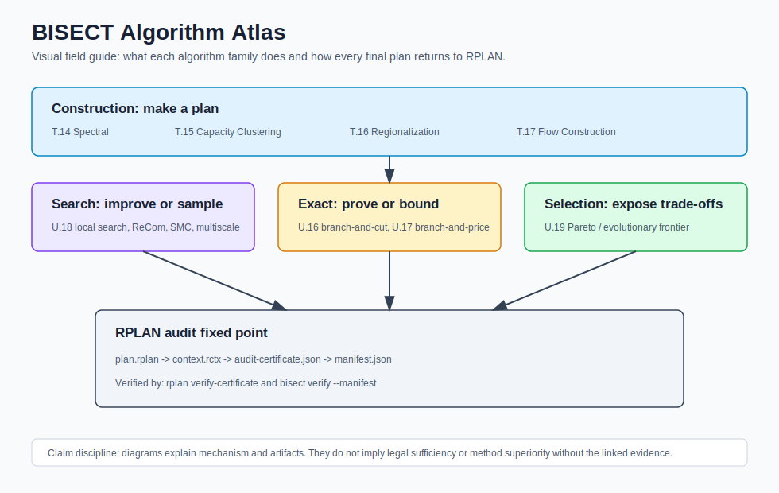

# Algorithm Atlas

The Algorithm Atlas is the visual field guide for BISECT's algorithm families.
It complements `docs/concepts/` and the research papers with small diagrams,
plain-language summaries, and links to the crates, CLI surfaces, papers, and
RPLAN packages that make each method concrete.

## Overview



Every family can use different internal machinery, but publication-grade plan
outputs converge on the same fixed point:

```text
algorithm output -> RPLAN -> RCTX -> audit certificate -> manifest -> verifier
```

## How BISECT Uses These Algorithms

BISECT is not only a collection of standalone algorithms. The construction
methods are ways to make the next auditable plan-building decision: choose a
balanced split, choose seeds, grow capacity-aware assignments, merge regions, or
prove that the declared construction profile cannot be satisfied.

| Role In BISECT | Algorithms That Play This Role |
|---|---|
| Choose a balanced bisection cut | T.14 spectral partitioning |
| Choose seed centers for district growth | T.15 capacity clustering, T.17 flow construction |
| Assign units under population capacity | T.15 capacity clustering, T.17 flow construction |
| Build larger connected regions from smaller ones | T.16 hierarchical regionalization |
| Emit infeasibility or repair evidence instead of hiding failure | T.15 capacity clustering, T.17 flow construction |

In other words, the algorithm is the construction engine, but the BISECT system
cares just as much about the evidence trail. A method is useful when its choices
can be replayed, summarized, packaged as RPLAN/RCTX, and checked by the verifier.

## Visual Grammar

The atlas uses a few repeated visual conventions so the pages can be read as a
family rather than as isolated pictures:

| Shape | Meaning |
|---|---|
| Graph nodes and edges | Units, precincts, blocks, or intermediate regions |
| Thick divider | A candidate cut, cluster boundary, or assignment boundary |
| Colored region | A district, cluster, flow bin, or merged regional unit |
| Table-like witness | Data recorded so the result can be replayed or audited |
| Red or amber path | Constraint pressure, repair, or infeasibility behavior |
| Blue package rail | The fixed point from algorithm output to RPLAN/RCTX/certificate |

Each algorithm page is organized around four questions:

1. What object does the algorithm operate on?
2. What choice does it make at each step?
3. What evidence is emitted so another tool can replay or reject the result?
4. Where is the claim boundary, especially when a result is infeasible or only
   benchmark-tier?

## Construction Family

| Algorithm | Visual Guide | What To Look For |
|---|---|---|
| T.14 Spectral Partitioning | [T.14 Spectral Partitioning](t14-spectral-partitioning.md) | Fiedler ordering, sweep cuts, deterministic construction |
| T.15 Capacity-Constrained Clustering | [T.15 Capacity Clustering](t15-capacity-clustering.md) | Seeds, capacity-aware assignment, repair/status lineage |
| T.16 Hierarchical Regionalization | [T.16 Hierarchical Regionalization](t16-hierarchical-regionalization.md) | Adjacent merges, merge log, hierarchy depth |
| T.17 Flow-Based Construction | [T.17 Flow Construction](t17-flow-construction.md) | Seeds, capacities, flow-style assignment, infeasibility witness |

## Search, Optimization, And Audit Family

| Algorithm | Visual Guide | What To Look For |
|---|---|---|
| U.16 Branch-And-Cut | [U.16 Branch-And-Cut](u16-branch-and-cut.md) | ILP model, connectivity cuts, solver status, bounds/gaps |
| U.17 Branch-And-Price | [U.17 Branch-And-Price](u17-branch-and-price.md) | District columns, pricing, master problem, formulation status |
| U.18 Local Search | [U.18 Local Search](u18-local-search.md) | Boundary moves, validity-preserving improvement, search summary |
| U.19 Evolutionary Comparison | [U.19 Evolutionary Comparison](u19-evolutionary-comparison.md) | Crossover/mutation, Pareto frontier, selected-frontier package |
| U.20 RPLAN Audit Certificates | [U.20 RPLAN Audit Certificates](u20-rplan-audit-certificates.md) | Fixed point, hashes, certificate verification, failure reasons |

## Sampling And Ensemble Family

| Algorithm | Visual Guide | What To Look For |
|---|---|---|
| ReCom Ensemble | [ReCom Ensemble](recom-ensemble.md) | Merge adjacent districts, sample spanning tree, cut balanced edge |
| Sequential Monte Carlo | [Sequential Monte Carlo](sequential-monte-carlo.md) | Particles, staged district proposals, weights, ESS resampling |
| Multiscale MCMC | [Multiscale MCMC](multiscale-mcmc.md) | Coarse/fine hierarchy, tract moves, block-group moves, rebalance |

## Coming Next

The next atlas pages should cover:

- older B/T section algorithms such as GeoSection, AreaSection, and
  ApportionRegions
- weights/search layer pages such as County-Sticky, ConvergenceSweep, and
  PercentileSweep

## Relationship To Other Docs

- `docs/concepts/algorithm-family-layer-cake.md` is the crate and evidence
  taxonomy.
- `docs/concepts/t-u-portfolio-dependency-map.md` maps papers, packages, and
  verifier paths.
- `docs/PAPERS.md` is the publication index.
- `docs/examples/rplan-benchmark-packages/` contains committed benchmark-tier
  packages referenced by these pages.
