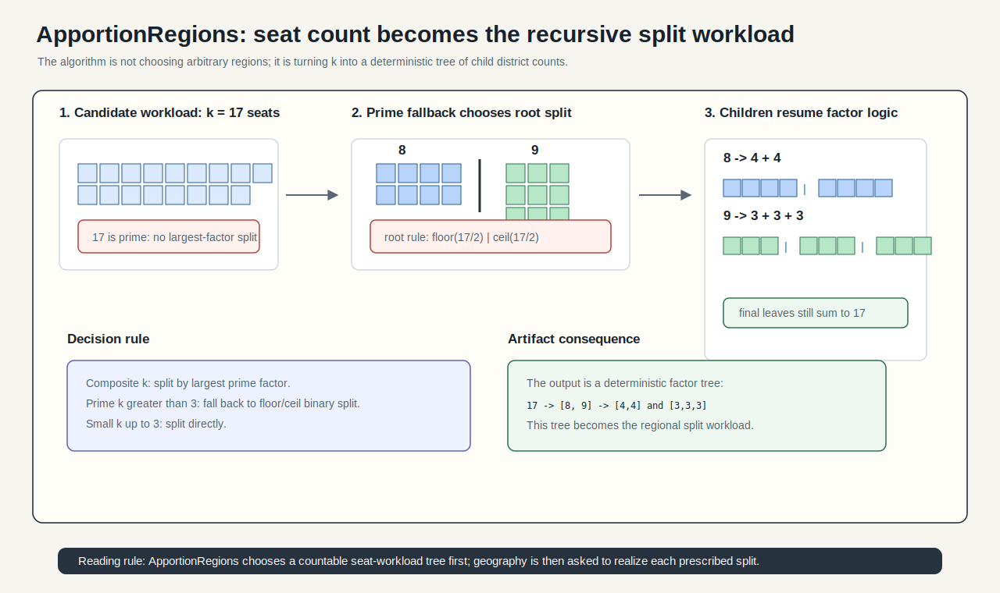
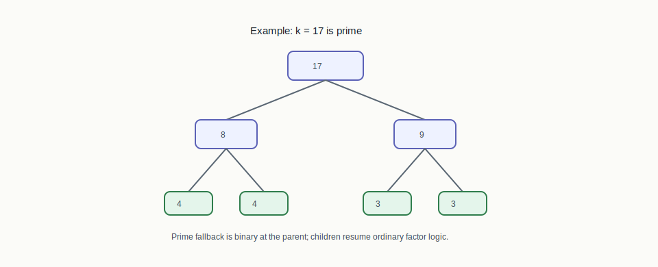
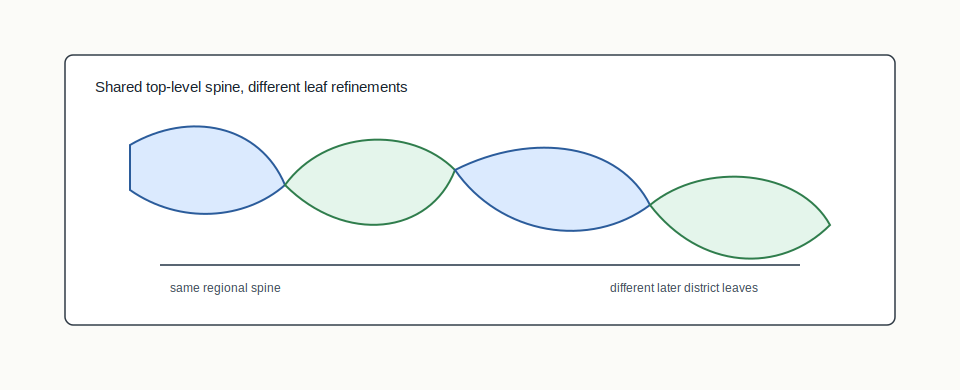

# ApportionRegions



## Mental Model

ApportionRegions chooses the bisection tree from the factorization of the seat
count. Composite counts split by their largest prime factor. Small counts up to
three can split directly. Prime counts fall back to a floor/ceil binary split,
after which composite subproblems may use non-binary splits again.

## How BISECT Uses It

BISECT uses ApportionRegions when the plan should be generated from a stable
factorization spine:

```text
seat count k -> factor tree -> regional split sequence -> district leaves
```

The useful property is reuse: related seat counts can share a top-level spine
when their factorization structure aligns.

## Picture 1: Prime Fallback Then Composite Children



When `k` is prime and larger than three, ApportionRegions cannot split by a
non-trivial factor. It falls back to a floor/ceil binary split. The children are
then handled normally: a child with `k=9` can split as `3 x 3`, while a child
with `k=8` can use binary factors.

## Picture 2: Reusable Regional Spine



The spine property matters because related seat counts can share an early
regional split. That does not prove the same final districts, but it gives the
pipeline a stable top-level geography to compare across reapportionment
scenarios.

## Worked Factor Tree

For `k = 18`, the largest prime factor is `3`, so the root can split into three
regions of six districts each:

```text
18
├─ 6
│  ├─ 3
│  └─ 3
├─ 6
│  ├─ 3
│  └─ 3
└─ 6
   ├─ 3
   └─ 3
```

For `k = 17`, there is no non-trivial factor. The root falls back to `8 + 9`,
then the `9` child can split as `3 x 3`.

## Tree Reading Checklist

- Composite nodes should name the factor that determined their split.
- Prime fallback nodes should be labeled as floor/ceil, not factor splits.
- The final leaves should add back up to the target district count.
- A reused spine means reused regional hierarchy, not identical final districts.

## Step-By-Step Mechanics

1. Read the target district count `k`.
2. If `k <= 3`, create a direct `k`-way split.
3. If `k` is composite, split by its largest prime factor.
4. If `k` is prime and larger than three, split into `floor(k/2)` and
   `ceil(k/2)`.
5. Recurse on each child target count.
6. Record the resulting bisection/factor tree.

## What The Output Needs To Explain

The evidence should expose the factor tree, the split prescribed at each node,
the fallback rule for prime targets, and the final district leaves. For
cross-cycle comparisons, it should identify which top-level spine was reused.

Example output fields:

```json
{
  "structure": "prime-factor",
  "target_districts": 17,
  "root_split": [8, 9],
  "root_rule": "prime_floor_ceil_fallback",
  "children": [
    { "k": 8, "rule": "largest_prime_factor" },
    { "k": 9, "rule": "largest_prime_factor" }
  ]
}
```

## Claim Boundary

ApportionRegions defines a deterministic tree topology. Claims about national
partisan outcomes, compactness frontier behavior, or legal sufficiency require
separate empirical evidence and uncertainty qualification.

## Failure Modes

- A prime fallback is described as if it were a largest-prime-factor split.
- Direct `k <= 3` splits are mistaken for recursive binary halves.
- Reuse of a top-level spine is overstated as reuse of final district lines.

## References In This Repo

- Structure value: `prime-factor`
- Legacy mode: `apportion-regions`
- Crate: `bisect-apportion`
- Concept guide: `docs/concepts/section-algorithms.md`
- Pipeline tests: `crates/bisect-cli/tests/spec7_pipeline_l2.rs`
