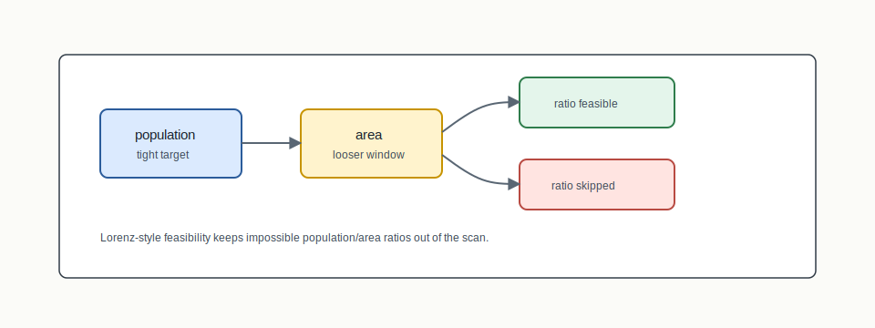

# AreaSection



## Mental Model

AreaSection extends GeoSection with a second balancing signal: land area. The
population constraint stays tight, while the area constraint is looser. The goal
is not equal-area districts at any cost; it is to avoid geographically extreme
splits when population and area can both be kept reasonable.

## How BISECT Uses It

BISECT uses AreaSection when the first-level ratio scan should account for both
population and land area:

```text
ratio scan + population target + area window -> feasible section choice
```

The Lorenz feasibility check helps identify ratios that cannot satisfy the
declared population/area regime before wasting solver calls.

## Step-By-Step Mechanics

1. Compute population and land-area weights for units.
2. Build the population-area feasibility view.
3. Skip ratios whose feasible area window is empty.
4. Run the ratio scan with dual constraints.
5. Select the best feasible normalized ratio.
6. Recurse using the chosen sectioning structure.

## Claim Boundary

AreaSection is a structure-layer method with a specific area-balance regime.
When population and area conflict, population remains the tighter legal
constraint. Area balance is not a guarantee of equal land area everywhere.

## References In This Repo

- Structure value: `ratio-optimal-area`
- Legacy mode: `areasection`
- Concept guide: `docs/concepts/section-algorithms.md`
