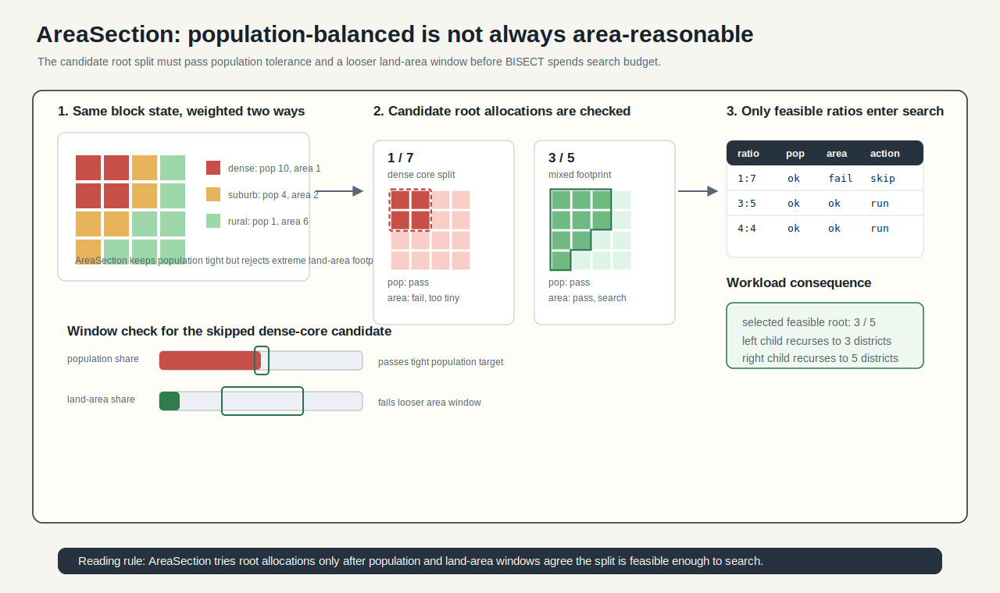
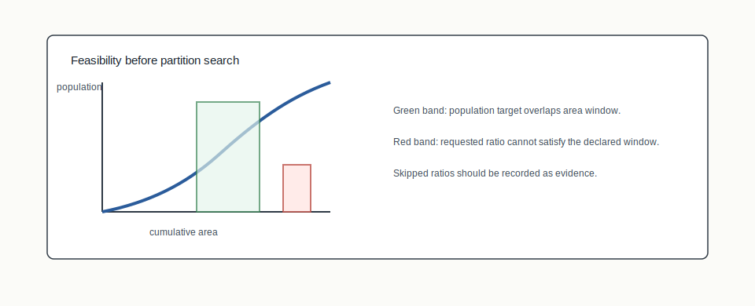

# AreaSection


## Mental Model

AreaSection extends GeoSection with a second balancing signal: land area. The
population constraint stays tight, while the area constraint is looser. The goal
is not equal-area districts at any cost; it is to avoid geographically extreme
splits when population and area can both be kept reasonable.

## How BISECT Uses It

BISECT uses AreaSection when the first-level ratio scan should account for both
population and land area:

```text
ratio scan + population target + area window -> feasible section choice
```

The Lorenz feasibility check helps identify ratios that cannot satisfy the
declared population/area regime before wasting solver calls.

## Picture 1: Population Balance And Land-Area Pressure



AreaSection has to keep population tight while treating land area as a looser
shape signal. Dense urban units can carry much more population per square mile
than rural units. A population-balanced split can therefore be geographically
small on one side and huge on the other. The area window makes that pressure
visible.

## Picture 2: Feasibility Filter



The feasibility filter asks whether the requested population share can plausibly
fit inside the declared area window. Ratios outside the feasible band should be
skipped before the expensive partition search begins.

## Worked Population-Area Tension

Imagine six units with equal population target pressure but very different land
area:

| Unit group | Population share | Land-area share | What it means |
|---|---:|---:|---|
| Dense city core | 50% | 8% | population balance can be met in a tiny footprint |
| Inner suburbs | 25% | 17% | moderate population and area |
| Rural remainder | 25% | 75% | low population density dominates land area |

A population-only split can choose the dense city core as one side and satisfy
population perfectly while producing an extreme area division. AreaSection keeps
population as the tight constraint, then asks whether the land-area share falls
inside the declared area window.

## Feasibility Reading Checklist

- A skipped ratio is not a failed partition; it is a ratio rejected before
  search because the population/area window is empty.
- A feasible ratio still needs a graph cut that satisfies population tolerance,
  contiguity, and the configured area swing.
- The output should say whether population or area was binding, because those
  are different explanations for why a split was hard.

## Step-By-Step Mechanics

1. Compute population and land-area weights for units.
2. Build the population-area feasibility view.
3. Skip ratios whose feasible area window is empty.
4. Run the ratio scan with dual constraints.
5. Select the best feasible normalized ratio.
6. Recurse using the chosen sectioning structure.

## What The Output Needs To Explain

AreaSection evidence should report population tolerance, area swing, unit area
source, skipped ratios, selected ratio, and whether population or area was the
binding constraint.

Example output fields:

```json
{
  "structure": "ratio-optimal-area",
  "population_tolerance": 0.005,
  "area_swing": 0.20,
  "area_source": "ALAND",
  "skipped_ratios": [{ "ratio": [1, 7], "reason": "empty_area_window" }],
  "selected_ratio": [3, 5],
  "binding_constraint": "population"
}
```

## Claim Boundary

AreaSection is a structure-layer method with a specific area-balance regime.
When population and area conflict, population remains the tighter legal
constraint. Area balance is not a guarantee of equal land area everywhere.

## Failure Modes

- ALAND or geography source is from the wrong census vintage.
- A strict area window makes many ratios infeasible, but the page or report does
  not say which ratios were skipped.
- The method is described as legally requiring equal area, which it does not.

## References In This Repo

- Structure value: `ratio-optimal-area`
- Legacy mode: `areasection`
- Concept guide: `docs/concepts/section-algorithms.md`
- Data provenance pressure: `docs/concepts/three-layer-compositor.md`
