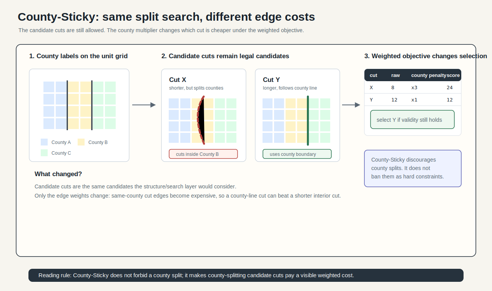
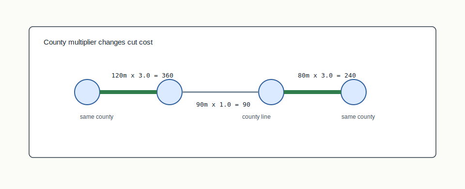
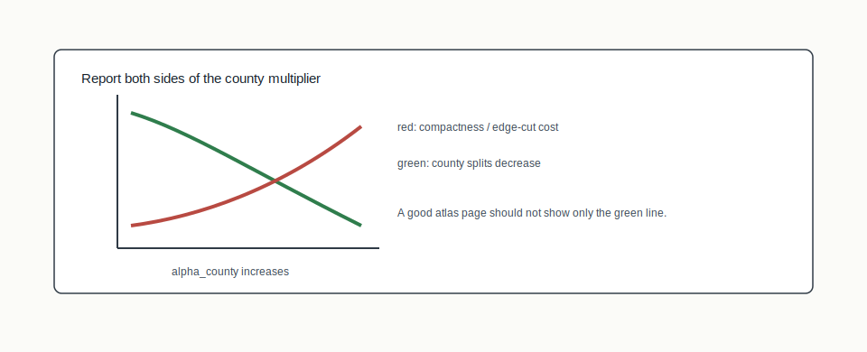

# County-Sticky Weights



## Mental Model

County-Sticky is a weights-layer method, not a structure algorithm. It boosts
intra-county edges so METIS is more reluctant to cut inside a county. The tree
shape can still be standard bisection, GeoSection, ApportionRegions, or another
structure mode.

## How BISECT Uses It

BISECT uses County-Sticky when county integrity should influence cut costs:

```text
same structure + boosted intra-county edges -> fewer county splits
```

Because it changes the meaning of edge cut, it is best understood as a
trade-off knob: fewer county splits may cost some compactness.

## Picture 0: Candidate Cuts And Weighted Consequence


County-Sticky keeps the same candidate cut search, but changes the cost of
candidate cuts. In the figure, Cut X is shorter in raw boundary length but cuts
inside a county, so the same-county multiplier makes it expensive. Cut Y is
longer but follows a county boundary, so it can win the weighted objective if
population and contiguity remain valid.

## Picture 1: Weight Multiplication



The method does not add a hard county constraint. It changes the graph weights.
If two units are in the same county, their shared edge receives a multiplier.
That makes cutting that edge more expensive for METIS, while still allowing the
cut when population balance or contiguity pressure requires it.

## Picture 2: Trade-Off Surface



County preservation is a trade-off, not a magic switch. Increasing the county
multiplier can reduce county splits, but it can also increase perimeter or edge
cut. A mature report should show both sides of the trade.

## Worked Edge Weights

County-Sticky only changes the edge costs the structure/search layers see. The
candidate set remains a structure/search question; the weights layer changes
which candidate looks cheaper:

| Edge | County relationship | Base edge weight | `alpha_county` | Effective weight |
|---|---|---:|---:|---:|
| A-B | same county | 4 | 3.0 | 12 |
| B-C | county boundary | 4 | 3.0 | 4 |
| C-D | same county | 2 | 3.0 | 6 |

METIS can still cut A-B, but it now pays three times as much as it would have
without the county multiplier. That is why this belongs in the weights layer:
it changes the cut objective, not the recursive split tree.

## Report Reading Checklist

- Compare against the same structure and search mode with `alpha_county = 1`.
- Report county splits and compactness separately.
- State whether county labels came from unit metadata, a join file, or a
  preprocessed graph attribute.

## Step-By-Step Mechanics

1. Build the adjacency graph and county labels.
2. Identify edges whose endpoints are in the same county.
3. Multiply those edge weights by the configured county factor.
4. Run the selected structure/search layers with the modified weights.
5. Report county splits and compactness effects separately.

## What The Output Needs To Explain

The output should report the county multiplier, how county labels were joined,
which metric counts county splits, and the compactness effect relative to the
same structure/search run without the county multiplier.

Example output fields:

```json
{
  "weights": "county",
  "alpha_county": 3.0,
  "county_label_source": "unit.county_geoid",
  "baseline_county_splits": 14,
  "weighted_county_splits": 9,
  "edge_cut_delta": 0.08
}
```

## Claim Boundary

County-Sticky discourages county splits; it does not ban them. Population
balance and contiguity can still force cuts within counties.
It also does not automatically satisfy state subdivision-preservation law,
which varies by jurisdiction.

## Failure Modes

- County labels are missing or joined with malformed GEOIDs.
- The page claims counties are preserved as a hard legal constraint.
- Compactness cost is omitted when split reduction is reported.

## References In This Repo

- Weights value: `county`
- Config knob: `alpha_county`
- Concept guide: `docs/concepts/section-algorithms.md`
- State-law caution: `.roles/ward.md`
