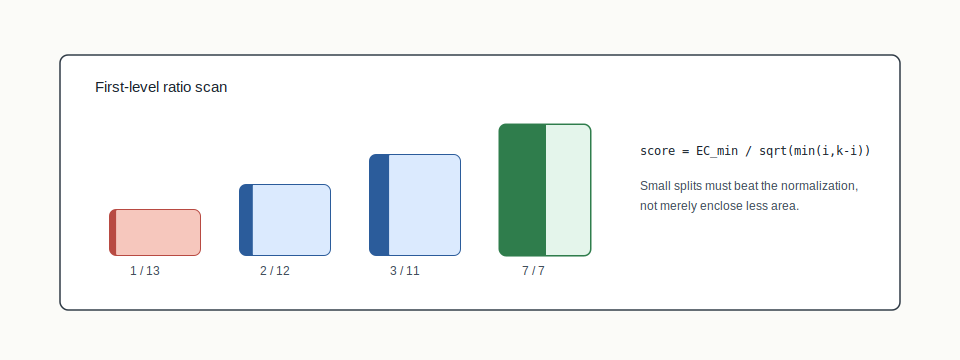
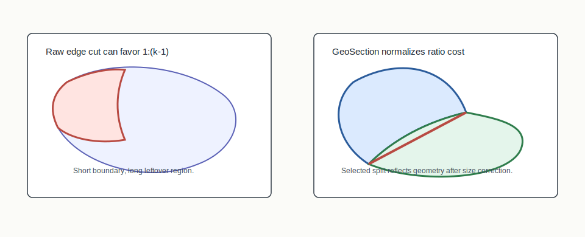

# GeoSection



## Mental Model

GeoSection solves the caterpillar problem in recursive bisection. A tiny
1:(k-1) split can look artificially cheap because enclosing a small region has a
short boundary. GeoSection scans first-level split ratios and normalizes edge
cut by `sqrt(min(i, k-i))` so small-ratio splits do not win only because they
are small.

The ratios are tried because the first split decides how many final districts
each child region must contain. For `k = 14`, a `1:13` root split means "make
one district on the left, then recursively make thirteen on the right." A `7:7`
root split means "make two child regions that each recursively produce seven
districts." GeoSection is choosing the root allocation of the recursion tree,
not merely drawing a one-time boundary.

## How BISECT Uses It

BISECT uses GeoSection when the top-level split ratio should be chosen from
geometry rather than assumed:

```text
try root allocations -> normalize cut cost -> choose first-level split -> recurse
```

After the first level, subsequent regions use ordinary recursive bisection.

## Picture 1: Caterpillar Failure Versus Normalized Split



The unnormalized first-level scan can prefer a small 1:(k-1) enclosure because
the boundary around a small region is short. GeoSection asks whether that small
split is still good after correcting for the size of the smaller side. The goal
is to choose a first split that reflects state geometry rather than the
mechanical cheapness of enclosing a tiny district.

## Worked Ratio Scan

Suppose the target is `k = 8` districts and the top-level scan evaluates these
candidate first splits:

| Ratio | Raw edge cut | Normalizer | Normalized score | Interpretation |
|---|---:|---:|---:|---|
| `1:7` | 12 | `sqrt(1)` = 1.00 | 12.0 | cheap-looking small enclosure |
| `2:6` | 18 | `sqrt(2)` = 1.41 | 12.7 | still narrow |
| `3:5` | 22 | `sqrt(3)` = 1.73 | 12.7 | competitive |
| `4:4` | 26 | `sqrt(4)` = 2.00 | 13.0 | balanced but slightly worse |

Raw edge cut would pick `1:7`. GeoSection reads that as suspicious because the
small side is cheap to wrap. After normalization, the scan can prefer a larger
first split when it has comparable boundary cost per unit of section size.

## Visual Reading Checklist

- The small enclosure should look cheaper in raw perimeter, not magically bad.
- The normalized score should make the reader compare ratios rather than
  pictures alone.
- The chosen first split should become the root of the recursive bisection
  tree; later splits are ordinary recursive bisections inside each side.

## Step-By-Step Mechanics

1. For target `k`, enumerate root allocations from `1:(k-1)` through the
   balanced split.
2. Run the configured METIS/search budget for each candidate ratio.
3. Record the best edge cut for each ratio.
4. Score each ratio as `EC_min / sqrt(min(i, k-i))`.
5. Select the best normalized ratio.
6. Recurse inside the chosen regions.

## What The Output Needs To Explain

The GeoSection evidence should show the candidate ratios, seed budget, minimum
edge cut per ratio, normalized score per ratio, selected ratio, and the
subsequent recursive split tree.

Example output fields:

```json
{
  "structure": "ratio-optimal",
  "target_districts": 8,
  "seed_budget_per_ratio": 200,
  "selected_ratio": [3, 5],
  "ratios": [
    { "ratio": [1, 7], "best_edge_cut": 12, "score": 12.0 },
    { "ratio": [3, 5], "best_edge_cut": 22, "score": 12.7 }
  ]
}
```

## Claim Boundary

GeoSection explains a ratio-selection rule. It does not claim that one
statewide partisan result is legally required; empirical outcome claims need
their own seed and data provenance.

## Failure Modes

- A 1:(k-1) split wins because raw edge cut is used instead of normalized edge
  cut.
- The ratio scan changes seed budget across ratios, making comparisons unfair.
- The selected ratio is cited as a legal or partisan conclusion rather than a
  geometric construction choice.

## References In This Repo

- Structure value: `ratio-optimal`
- Legacy mode: `geosection`
- Concept guide: `docs/concepts/section-algorithms.md`
- CLI implementation/tests: `crates/bisect-cli/src/runner.rs`
