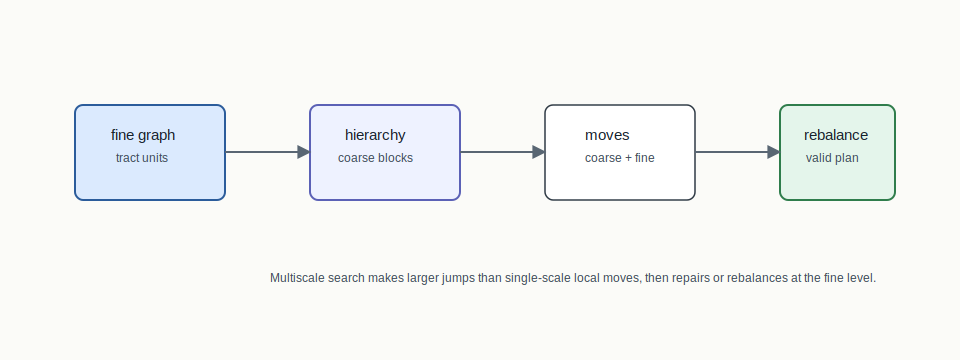
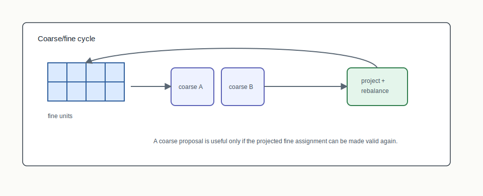
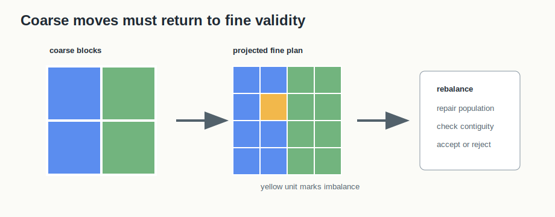

# Multiscale MCMC



## Mental Model

Multiscale MCMC alternates between fine and coarse views of the same plan. A
fine-level move can adjust tract assignments. A coarse-level move can perturb
larger blocks, such as block groups or counties, to help the chain move through
plan space more quickly.

The motivation is mixing: large states with many districts can be hard for a
single-scale ReCom chain to explore efficiently.

## How BISECT Uses It

BISECT uses multiscale machinery as a search accelerator and hierarchy-aware
sampler:

```text
fine graph -> coarse hierarchy -> coarse/fine moves -> rebalanced plan
```

It sits beside ReCom and SMC in the sampling/search substrate rather than in the
final RPLAN fixed point itself. Final exported plans still need the ordinary
RPLAN/RCTX/audit path.

## Picture 1: Coarse/Fine Move Cycle



The hierarchy maps fine units into coarse units. The chain can propose a coarse
move, project it back down, and rebalance at the fine level. Separate seed
derivation keeps steps deterministic for fixed inputs.

## Picture 2: Projection And Rebalance



A coarse move is only a proposal. It becomes a fine-level plan after projection,
then it must be rebalanced and checked against fine-level population and
connectivity constraints. This is the part of the algorithm that prevents a
large coarse jump from bypassing the ordinary validity story.

## Step-By-Step Mechanics

1. Build a hierarchy from fine units to coarse blocks.
2. Start from a valid fine-level assignment.
3. Propose fine-level moves for local exploration.
4. Propose coarse-level moves for larger jumps.
5. Project coarse proposals back to fine assignments.
6. Rebalance to restore population and validity constraints.
7. Compare mixing diagnostics against single-scale baselines.

## Reading The Output

The output should make the hierarchy visible: which fine units belong to which
coarse block, which move type was proposed, whether projection introduced
imbalance, and whether rebalancing accepted or rejected the move. Without that
evidence, a multiscale run is hard to distinguish from an unexplained heuristic
perturbation.

## What The Output Needs To Explain

The important evidence is the hierarchy definition, coarse tolerance, fine
tolerance, seed derivation, move type, acceptance or rejection status, and any
rebalance action needed to restore validity.

## Claim Boundary

The current crate documents and tests the multiscale substrate. Any claim that a
multiscale chain has the correct stationary distribution requires explicit
acceptance-ratio and target-distribution analysis. Without that, it should be
described as a heuristic mixing accelerator, not a proof-grade sampler.

## References In This Repo

- Crate: `bisect-multiscale`
- Core files: `crates/bisect-multiscale/src/chain.rs`, `crates/bisect-multiscale/src/hierarchy.rs`, `crates/bisect-multiscale/src/rebalance.rs`, `crates/bisect-multiscale/src/seeds.rs`
- Tests: `crates/bisect-multiscale/tests/L0_unit.rs`
