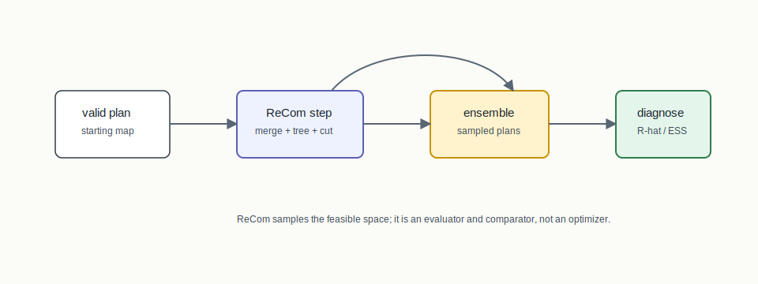
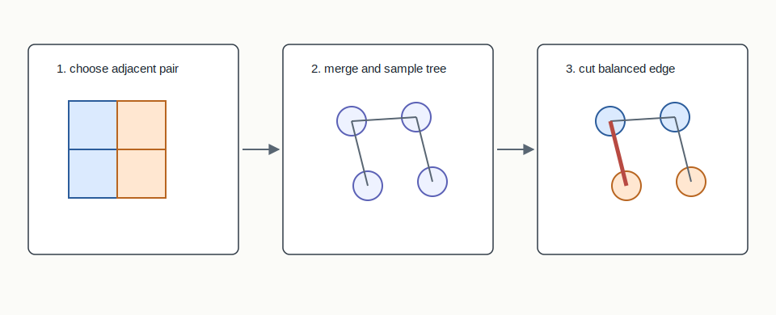
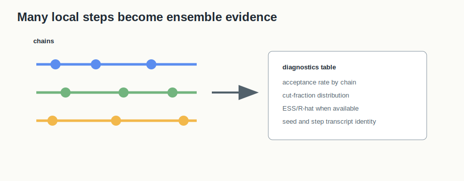

# ReCom Ensemble



## Mental Model

ReCom is a Markov chain over valid redistricting plans. Each step chooses two
adjacent districts, merges them into one connected region, samples a random
spanning tree of that region, and cuts a balanced edge to create two replacement
districts.

It does not optimize for the best plan. It samples plan space so BISECT can ask
where a constructed or enacted plan sits relative to a neutral distribution.

## How BISECT Uses It

BISECT uses ReCom-style ensembles as an evaluation and comparison layer:

```text
valid starting plan -> many valid sampled plans -> distributional comparison
```

This complements deterministic construction. A BISECT plan may be produced by a
constructor or solver, then compared against an ensemble to understand whether
its compactness, partisan outcome, or other metric is typical or outlying.

## Picture 1: One ReCom Step



The key move is local but plan-scale: merge two adjacent districts, draw a
uniform spanning tree of the merged region, enumerate balanced tree cuts, and
select one balanced edge. If no balanced cut exists, the implementation can
resample or try another pair according to the configured chain variant.

## Picture 2: Ensemble Diagnostics



One ReCom step is easy to draw, but the algorithm becomes useful through many
steps and often multiple chains. The diagnostic view records whether chains are
moving, whether cut fractions are stable, and whether summary metrics have
enough effective sample size to support the comparison being made.

## Step-By-Step Mechanics

1. Start from a valid district assignment.
2. Choose adjacent districts.
3. Merge their units into one connected subgraph.
4. Sample a random spanning tree, using Wilson-style machinery in the native
   ensemble path.
5. Enumerate balanced cuts of the tree.
6. Accept a replacement pair when the cut preserves the declared tolerance.
7. Record step diagnostics such as cut fraction, population deviation, and
   acceptance.

## Reading The Output

The chain transcript should let a reviewer distinguish "the step was rejected,"
"the pair had no balanced cut," "the chain moved but the summary did not mix,"
and "the ensemble comparison was run with too few accepted samples." Those are
different stories, and they should not collapse into a single sample count.

## What The Output Needs To Explain

The ensemble output needs chain seeds, per-chain step records, acceptance
behavior, cut-fraction summaries, R-hat/ESS diagnostics when available, and
enough seed derivation detail to make fixed-seed runs reproducible.

## Claim Boundary

ReCom characterizes a sampling distribution. It does not prove optimality, and
finite ensembles do not prove full plan-space convergence. Diagnostics such as
R-hat and ESS are evidence about the sampled summaries, not universal guarantees
about every legal or political claim.

## References In This Repo

- Crate: `bisect-ensemble`
- Concept guide: `docs/concepts/ensemble-methods.md`
- Core files: `crates/bisect-ensemble/src/recom.rs`, `crates/bisect-ensemble/src/chain.rs`
- Tests: `crates/bisect-ensemble/tests/ensemble_l1.rs`, `crates/bisect-ensemble/tests/ensemble_l2.rs`
