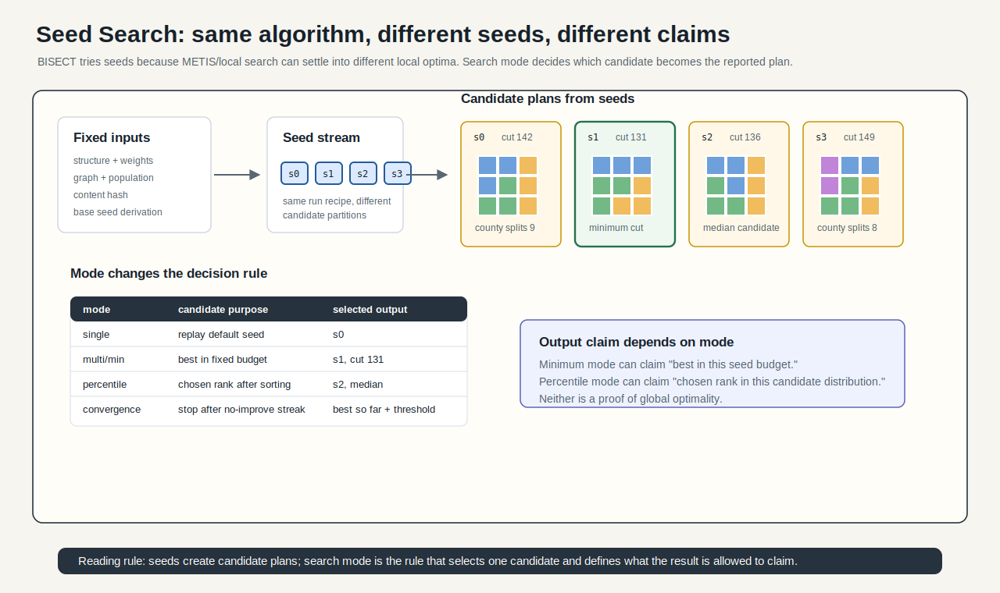

# Seed Search Modes



## Mental Model

The search layer controls how BISECT explores seed-dependent local optima. The
same structure and weights can produce different candidate plans when METIS or
local ReCom is seeded differently. Search mode decides which candidates are
considered and which result is returned.

## How BISECT Uses It

BISECT uses seed search to make run selection explicit:

```text
content-derived seed stream -> candidate plans -> selected result
```

The major modes are `single`, `multi`, `convergence`, `percentile`, and
`bisection-ensemble`.

## Step-By-Step Mechanics

1. `single`: run one publicly derived seed.
2. `multi`: run a fixed seed budget and return the minimum cut.
3. `convergence`: walk seeds until a threshold number of consecutive seeds
   produce no improvement.
4. `percentile`: sort candidates and return a requested percentile rather than
   the minimum.
5. `bisection-ensemble`: replace a binary METIS call with local ReCom sampling
   at that bisection node.

## Claim Boundary

Search mode affects evidence. A single deterministic plan, a minimum over many
seeds, a percentile plan, and a local ensemble bisection answer different
questions. They should not be cited as the same claim.

## References In This Repo

- Concept guide: `docs/concepts/three-layer-compositor.md`
- Taxonomy: `docs/concepts/section-algorithms.md`
- CLI implementation: `crates/bisect-cli/src/runner.rs`
