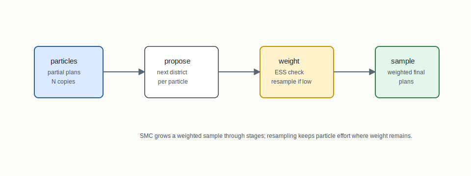
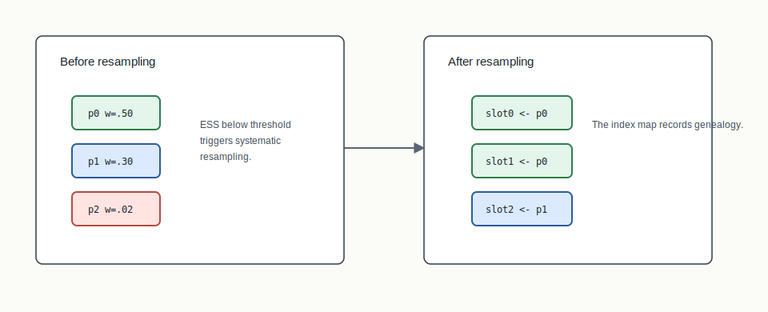
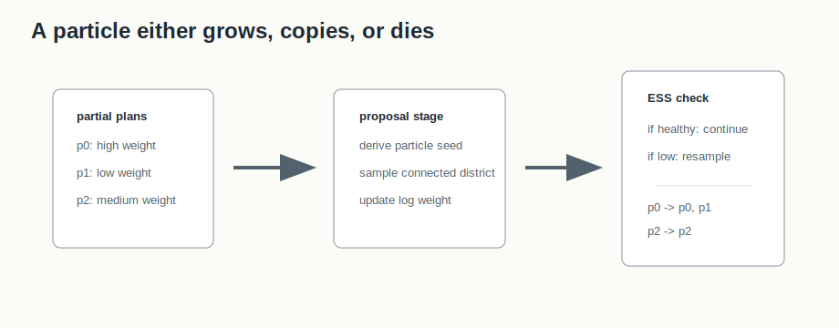

# Sequential Monte Carlo



## Mental Model

Sequential Monte Carlo builds many partial plans in parallel. Each particle is
a partially assigned plan. At each stage, particles propose another district,
receive weights, and may be resampled when effective sample size falls too low.

Unlike ReCom, which moves a complete plan through a Markov chain, SMC grows a
weighted sample of plans through staged construction.

## How BISECT Uses It

BISECT uses SMC as a particle-based sampling substrate:

```text
many partial plans -> staged proposals -> weighted completed plan sample
```

The SMC output is useful when the audit question is distributional and the
construction process itself should expose particle weights, resampling stages,
and deterministic seed derivation.

## Picture 0: Particle Weights To Resampling Genealogy

The opening figure shows the SMC lifecycle as an event ledger. Particles propose
districts with derived seeds, receive log weights, and may die when proposals
fail. When effective sample size drops below the threshold, systematic
resampling copies high-weight ancestors forward. The ancestor map is the key
visual object: after resampling, a particle slot may no longer descend from its
own earlier proposal.

For BISECT, the final weighted plans are only interpretable with this genealogy.
The NDJSON stream needs proposal status, weights, ESS trigger, ancestor map,
completion weights, and seed identity so the sample is reproducible for the
declared input and base seed.

## Picture 1: Particles, Weights, And Resampling



A low-weight particle can disappear during systematic resampling; a high-weight
particle can be copied into multiple slots. The output records resample maps so
the particle genealogy is not hidden.

## Picture 2: Proposal, Weight, Resample



The important SMC picture is not only the final sample. It is the path by which
partial plans survive: proposal seed, connected district proposal, log-weight
update, ESS check, and resampling genealogy.

## Step-By-Step Mechanics

1. Initialize `n_particles` empty partial plans.
2. For each stage, derive deterministic particle seeds.
3. Propose a connected, population-balanced district for each particle.
4. Update log weights for surviving proposals.
5. Compute effective sample size.
6. Systematically resample when ESS falls below the configured threshold.
7. Assign remaining units at the final stage and emit weighted completed plans.

## Reading The Output

An NDJSON run is a ledger. Metadata says which graph, seed, and configuration
were used. Particle records say what each particle proposed and how it was
weighted. Resampling records say which ancestors were copied forward. If all
particles die, that failure is an informative output about the proposal and
tolerance settings.

## Worked Particle Ledger

| Stage | Particle | Proposal | Log weight | Event |
|---:|---:|---|---:|---|
| 0 | 0 | seed district A | -0.2 | survives |
| 0 | 1 | seed district B | -2.8 | low weight |
| 0 | 2 | seed district C | -0.5 | survives |
| 1 | 1 | copied from particle 0 | -0.2 | resampled |

This is why SMC output needs genealogy. After resampling, particle 1 may no
longer be the descendant of its own earlier proposal. The record should say
which ancestor was copied forward.

## NDJSON Reading Checklist

- Metadata records should appear before particle events.
- Proposal events should include stage, particle index, derived seed, and
  proposal status.
- Resampling events should include ancestor maps, not only the new particle
  count.
- Completion records should carry final weights and plan identity.

## What The Output Needs To Explain

The NDJSON stream records particle plans, log weights, particle indexes,
resampling events, metadata, seed formulas, and file hash identity. Those fields
make the sample reproducible for a fixed input and base seed.

Example event shapes:

```json
{ "type": "metadata", "base_seed": 73, "n_particles": 3 }
{ "type": "particle", "stage": 0, "particle": 1, "log_weight": -2.8 }
{ "type": "resample", "stage": 1, "ancestors": [0, 0, 2] }
```

## Claim Boundary

SMC produces a weighted sample under the declared proposal and weighting scheme.
It does not certify that every particle path is equally likely, and an
all-particles-killed result is a structured failure that usually indicates too
few particles or too strict a tolerance.

## References In This Repo

- Crate: `bisect-smc`
- Core files: `crates/bisect-smc/src/algorithm.rs`, `crates/bisect-smc/src/proposal.rs`, `crates/bisect-smc/src/resample.rs`, `crates/bisect-smc/src/output.rs`
- Tests: `crates/bisect-smc/tests/L1_integration.rs`, `crates/bisect-smc/tests/L2_real.rs`
