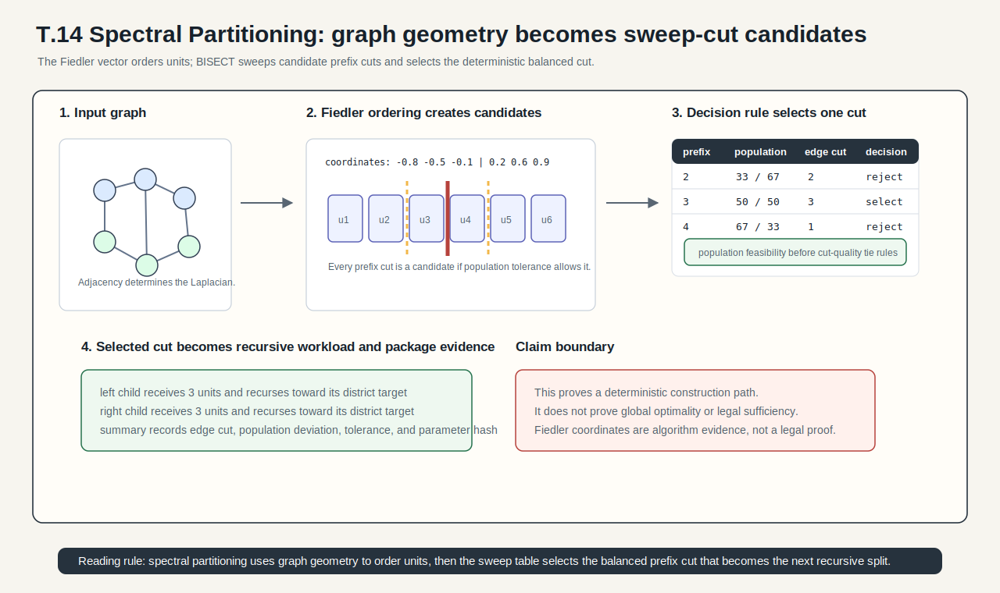
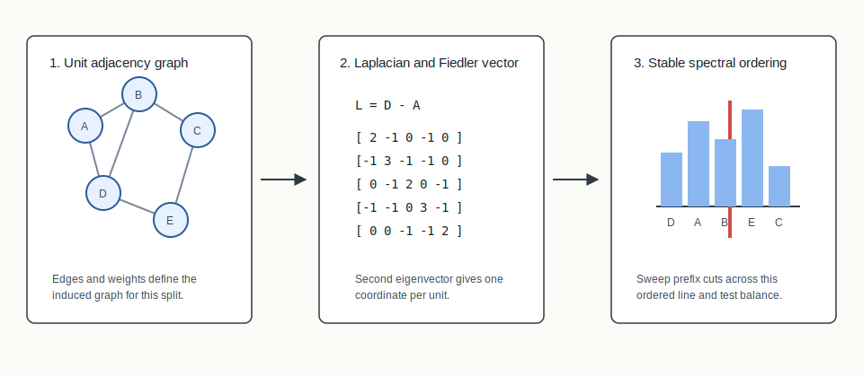
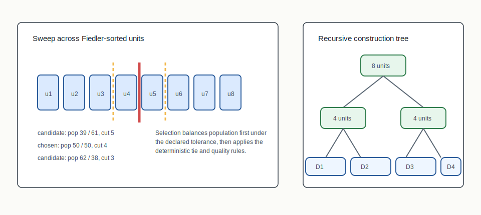

# T.14 Spectral Partitioning



## Mental Model

Spectral partitioning asks the graph to suggest its own weakest balanced split.
The unit adjacency graph becomes a Laplacian matrix. The Fiedler vector, the
second-smallest eigenvector of that Laplacian, assigns each unit a coordinate
that tends to place loosely connected graph regions far apart on a line. BISECT
sorts units by that coordinate and sweeps possible prefix cuts until it finds
the best population-balanced split under the declared tolerance.

The important point is that T.14 is not "draw a pretty line." It is a staged,
deterministic graph construction:

```text
graph structure -> spectral coordinate -> ordered units -> sweep candidates
```

The current staged implementation uses that split recursively. When the target
district count is not a power of two, the recursive call receives proportional
left/right seat targets so the tree can still end at the requested number of
districts.

## Algorithm Shape

```text
adjacency graph
  -> graph Laplacian
  -> Fiedler vector
  -> ordered units
  -> balanced sweep cut
  -> RPLAN/RCTX/certificate package
```

## Picture 1: Laplacian To Ordering



The adjacency graph says which units touch. The Laplacian turns that graph into
a matrix whose eigenvectors describe graph vibration modes. The first nontrivial
mode, the Fiedler vector, is used as a one-dimensional coordinate. Units are
then sorted by that coordinate, with stable unit identifiers breaking ties.

This makes the algorithm explainable: if two units land far apart in the
ordering, the graph structure gave the algorithm evidence that they are weakly
coupled through the current induced subgraph.

## Picture 2: Sweep Cut And Recursion



After sorting, BISECT considers prefix cuts. Each candidate has a left-side
population, right-side population, edge-cut count or weight, and deviation from
the target population. The selected cut is the candidate closest to the target
within the configured tolerance and deterministic tie rules.

The selected two-way split becomes a branch in the recursive construction tree.
Each child branch repeats the same process on its induced subgraph until leaves
represent final districts.

## Step-By-Step Mechanics

1. Build the weighted graph induced by the current unit set.
2. Form the Laplacian used by `bisect-apportion::spectral`.
3. Approximate the Fiedler vector for that induced graph.
4. Sort units by spectral coordinate, then by stable id for reproducibility.
5. Sweep prefix cuts and evaluate population deviation and cut quality.
6. Select the deterministic best feasible cut.
7. Recurse with the left and right target district counts until leaves are final
   districts.

## What The Certificate Needs To Explain

The package summary records enough information to distinguish "this construction
ran deterministically" from "this plan is optimal." The important audit hooks
are the parameter hash, target count, tolerance, edge cut, population deviation,
and the plan/context/certificate chain. The Fiedler coordinates themselves are
implementation evidence rather than a legal proof.

## Inputs

- Unit adjacency graph
- Unit populations
- Target district count for the split stage
- Population tolerance

## Outputs

- District assignment
- Spectral summary with edge cut, population deviation, and parameter hash
- RPLAN plan, RCTX context, audit certificate, and manifest in package runs

## When To Use It

Use spectral partitioning when you want a transparent deterministic
construction baseline driven by graph geometry rather than random sampling.
It is especially useful as a benchmark because it is fast to explain: the graph
suggests an ordering, and the sweep chooses the balanced cut.

## Claim Boundary

Spectral partitioning proves a deterministic construction path and verifier
lineage. It does not prove legal sufficiency, optimality, or superiority over
other construction methods. Disconnected components, islands, and alternative
adjacency definitions are input-profile issues. Highly symmetric graphs can
also produce weak or tie-heavy spectral coordinates, which is why stable tie
handling matters.

## Tiny Example

On a path of ten equal-population units, the Fiedler ordering usually tracks the
path order. The sweep cut that splits five units from five units is both balanced
and easy to replay. On an irregular graph, the ordering can snake through
bridges or bottlenecks instead, which is the behavior the atlas diagrams are
trying to make visible.

## References In This Repo

- Crate/function: `bisect-apportion`
- Paper: `docs/papers/T.14+spectral-partitioning.pdf`
- Method package: `docs/examples/rplan-method-packages/T.14+spectral-generated-synthetic/`
- Benchmark package: `docs/examples/rplan-benchmark-packages/T.14+spectral-grid10-benchmark/`
