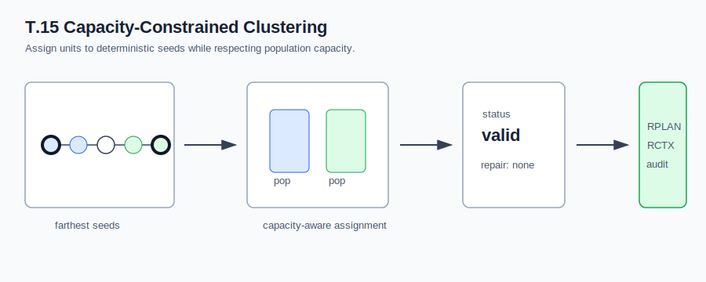
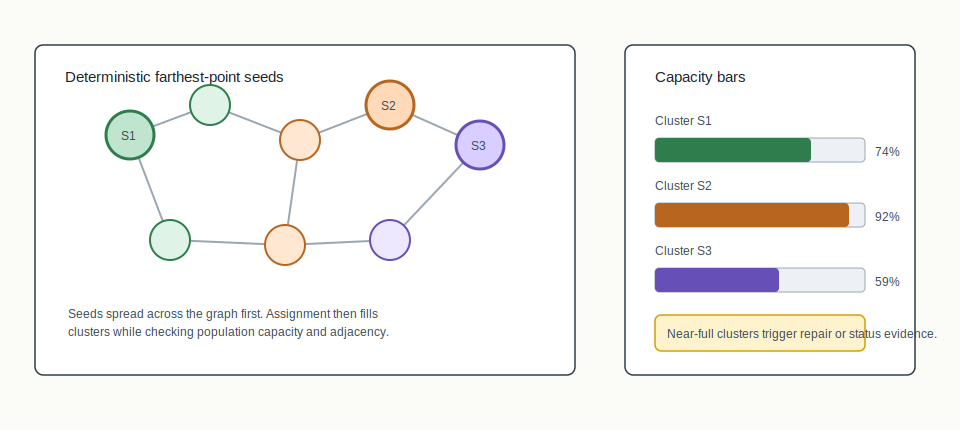
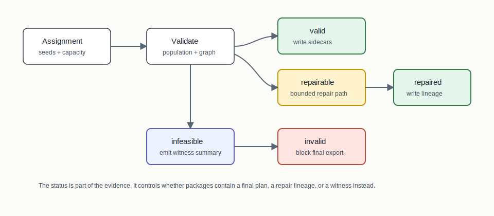

# T.15 Capacity-Constrained Clustering



## Mental Model

Capacity-constrained clustering is a seeded assignment algorithm with a visible
budget for every cluster. The seeds give the clusters starting positions. The
capacity profile says how much population each cluster can accept. The
assignment process then tries to attach units to seeds without overfilling a
cluster or breaking the declared validation profile.

The point of T.15 is not only to create clusters. It is to make capacity status
auditable. A result can be valid, repaired, infeasible, or invalid, and those
statuses mean different things for package export.

## How BISECT Uses It

T.15 is a seed-and-grow construction path. BISECT uses it when the next plan
building decision should start from seed centers rather than from a spectral
cut. The algorithm chooses deterministic farthest-point seeds, then assigns
units to those seeds while watching population capacity.

So the BISECT role is:

```text
graph + populations -> choose seeds -> grow capacity-aware district pieces
```

This can produce a full district assignment for benchmark packages, or it can
produce repair/infeasibility evidence when the staged capacity profile cannot be
met cleanly. The seed choices and status lineage are the key things BISECT needs
to preserve.

## Algorithm Shape

```text
adjacency + populations
  -> farthest-point seeds
  -> nearest-seed assignment with capacity checks
  -> connectedness and population validation
  -> optional repair/status lineage
  -> RPLAN/RCTX/certificate package
```

## Picture 1: Seeds And Capacity Pressure



The constructor begins with deterministic farthest-point seeds. The first seed
is chosen by the implementation's stable rule. Each later seed is the unit that
is farthest from the existing seed set, with stable identifiers resolving ties.
This spreads seed centers across the graph before assignment begins.

As units are assigned, each cluster's population bar fills. A unit that would
overfill one cluster must either be assigned elsewhere, deferred for repair, or
contribute to an infeasibility/invalid status depending on the declared profile.

## Picture 2: Status And Repair Lineage



The status is part of the algorithm, not an afterthought. `valid` means the
assignment passed the declared checks. `repaired` means the bounded repair path
was used and its lineage was recorded. `infeasible` means the profile could not
be satisfied by the staged constructor and a witness is emitted. `invalid` means
the extracted result failed validation and final export is blocked.

## Step-By-Step Mechanics

1. Read the unit graph, populations, target cluster count, and tolerance.
2. Select deterministic farthest-point seeds with stable tie-breaking.
3. Visit remaining units in deterministic order.
4. Assign each unit to an eligible cluster while respecting target capacity and
   slack.
5. Validate population and connectedness under the declared profile.
6. If the result is close enough, run bounded repair and record the repair
   lineage.
7. Emit a status: `valid`, `repaired`, `infeasible`, or `invalid`.

## What The Certificate Needs To Explain

The audit trail must explain seed selection, assignment status, population
deviation, edge cut, repair status, and the parameter hash. The package does not
need to claim that clustering found the best possible partition. It needs to
make clear what deterministic choices were made and whether the declared
capacity profile was satisfied.

## Inputs

- Unit adjacency graph
- Unit populations or weights
- Number of districts/clusters
- Population tolerance

## Outputs

- District assignment
- Cluster summary with capacity status, repair status, edge cut, and parameter
  hash
- RPLAN plan, RCTX context, audit certificate, and manifest in package runs

## When To Use It

Use capacity clustering when you want construction behavior that makes
population-capacity status explicit and audit-friendly.
It is a good baseline when population feasibility matters more than exploring a
large randomized ensemble.

## Claim Boundary

Capacity clustering establishes deterministic capacity-aware assignment and
status reporting. It does not certify compactness, community preservation,
partisan fairness, or legal sufficiency beyond the declared audit profile. An
`infeasible` status is relative to the constructor and the declared capacity
profile, not a mathematical proof that no possible districting exists.

## Tiny Example

Suppose three clusters each have capacity 100 and the graph has units with
populations 45, 40, 35, 30, and so on. The assignment path is constrained by the
bars: a geographically close unit might be rejected by a nearly full cluster
and sent to another seed. That is the behavior the status lineage is meant to
surface.

## References In This Repo

- Crate: `bisect-clustering`
- Paper: `docs/papers/T.15+capacity-constrained-clustering.pdf`
- Golden package: `docs/examples/rplan-golden-packages/T.15+capacity-constrained-clustering/`
- Benchmark package: `docs/examples/rplan-benchmark-packages/T.15+capacity-path100-benchmark/`
