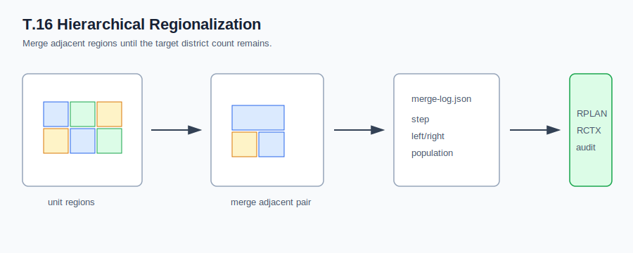
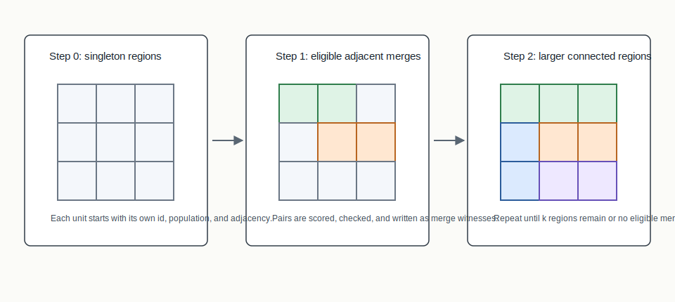
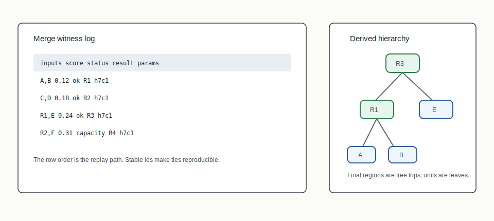

# T.16 Hierarchical Regionalization



## Mental Model

Hierarchical regionalization starts with each unit as its own region and
repeatedly merges adjacent regions using a deterministic balanced-agglomerative
policy until the target district count is reached. The merge log is a first
class artifact.

This makes the algorithm feel different from T.14 and T.15. Spectral
partitioning cuts downward from a whole graph. Clustering grows outward from
seeds. Hierarchical regionalization builds upward: singletons become small
regions, small regions become larger regions, and the final district assignment
is the top layer of a recorded merge tree.

## How BISECT Uses It

T.16 gives BISECT a bottom-up way to build district-scale regions. Instead of
choosing one cut or choosing seeds, it repeatedly chooses the next eligible
adjacent merge. Each merge must be explainable, so the merge witness is as
important as the final assignment.

So the BISECT role is:

```text
singleton units -> choose adjacent merges -> stop at k auditable regions
```

This is useful when the system needs a hierarchy of regions, not just a final
flat plan. Reviewers can inspect intermediate layers and replay why each larger
region exists.

## Algorithm Shape

```text
unit regions
  -> choose eligible adjacent pair
  -> merge regions
  -> record merge witness
  -> repeat until k regions remain
  -> RPLAN/RCTX/certificate package
```

## Picture 1: Merge Sequence



Every unit begins as a singleton region. The constructor enumerates adjacent
candidate pairs that remain eligible under the capacity and connectedness
profile. It scores those candidate pairs, chooses the best one, breaks ties by
stable region identifiers, records a witness, and repeats.

The visual result is a merge sequence. The audit result is a lineage: every
larger region can be traced back to the units it absorbed.

## Picture 2: Merge Log To Tree



The merge log is the core explanatory artifact. Each row says which two regions
were merged, what score made that merge eligible or preferred, what constraint
status was observed, and what result region id was created. The hierarchy tree
is derived from those rows.

## Step-By-Step Mechanics

1. Initialize each unit as a singleton region with population and adjacency
   metadata.
2. Enumerate adjacent candidate region pairs.
3. Discard pairs that violate the declared capacity or connectedness profile.
4. Score eligible pairs with the deterministic merge scoring rule.
5. Select the best pair, using stable ids for ties.
6. Record a merge witness with inputs, score, constraint status, output id, and
   parameter hash.
7. Repeat until the requested number of regions remains or no eligible merge is
   available.

## What The Certificate Needs To Explain

For T.16, the plan assignment alone is not enough. The certificate and sidecars
need to preserve the merge lineage because that is the reproducible evidence for
the construction. The final district ids explain the output, but the merge log
explains how the output was reached.

## Inputs

- Unit adjacency graph
- Unit populations or weights
- Number of target regions/districts
- Population tolerance

## Outputs

- District assignment
- Regionalization summary with merge count, hierarchy depth, edge cut, and
  population deviation
- Merge log
- RPLAN plan, RCTX context, audit certificate, and manifest in package runs

## When To Use It

Use regionalization when you want a construction trace that explains how small
connected units became larger connected regions through recorded merges.
It is also useful when you want intermediate hierarchy levels, because the same
lineage can be inspected before the final target count is reached.

## Claim Boundary

Regionalization explains a deterministic merge history and verifier lineage. It
does not prove that the merge tree is globally optimal, legally sufficient, or
better than clustering, flow construction, or METIS on real data. If the merge
routine stops early because no eligible adjacent pair remains, that is a
constructor/profile failure mode and should be represented as such rather than
as a valid final plan.

## Tiny Example

On a four-by-four grid, early merges may combine neighboring low-population
singletons into balanced small regions. Later merges become more constrained:
the algorithm can only combine adjacent regions whose combined population and
connectedness still pass the declared profile. The merge log is what lets a
reviewer see why one adjacent pair was chosen over another.

## References In This Repo

- Crate/module: `bisect-clustering::regionalization`
- Paper: `docs/papers/T.16+hierarchical-regionalization.pdf`
- Golden package: `docs/examples/rplan-golden-packages/T.16+hierarchical-regionalization/`
- Benchmark package: `docs/examples/rplan-benchmark-packages/T.16+regionalization-path100-benchmark/`
