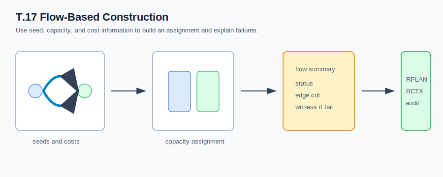

# T.17 Flow-Based Construction



## What It Does

Flow-based construction treats district assignment as a capacity/cost
construction problem. The current implementation is a deterministic baseline:
choose seeds, assign units through a flow-style capacity process, and emit a
summary that records validity, population deviation, edge cut, and any
infeasibility witness.

## Algorithm Shape

```text
adjacency + populations
  -> seed selection
  -> capacity/cost assignment
  -> repair or infeasibility witness
  -> flow summary
  -> RPLAN/RCTX/certificate package
```

## Inputs

- Unit adjacency graph
- Unit populations
- Target district count
- Balance tolerance

## Outputs

- District assignment
- Flow summary with status, seeds, edge cut, population deviation, and parameter
  hash
- Optional infeasibility witness
- RPLAN plan, RCTX context, audit certificate, and manifest in package runs

## When To Use It

Use flow construction when you want an assignment baseline that makes
capacity/cost status and infeasibility behavior explicit.

## Claim Boundary

Flow construction establishes benchmark-tier packaging and deterministic
capacity lineage. It is not yet a mature min-cost-flow solver and does not
prove legal sufficiency, optimality, or real-data quality.

## References In This Repo

- Crate: `bisect-flow`
- Paper: `docs/papers/T.17+flow-based-construction.pdf`
- Golden package: `docs/examples/rplan-golden-packages/T.17+flow-construction/`
- Benchmark package: `docs/examples/rplan-benchmark-packages/T.17+flow-path100-benchmark/`
