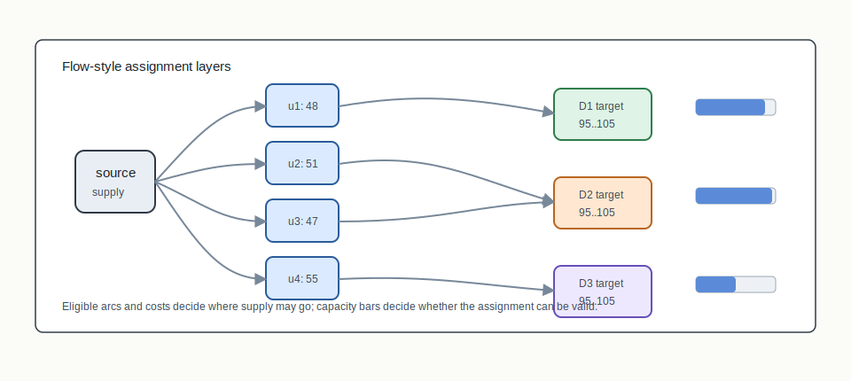
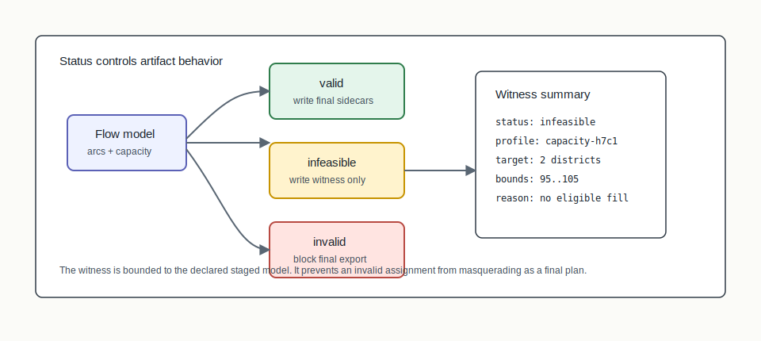

# T.17 Flow-Based Construction


## Mental Model

Flow-based construction treats assignment as movement from supply to capacity.
Units provide population supply. District bins or seeds provide demand-side
capacity. Eligible arcs say which assignments the declared graph/profile allows,
and costs make some assignments preferable to others.

The current T.17 implementation is a deterministic feasibility-oriented
baseline. It is deliberately narrower than the later U.16/U.17 optimization
machinery. The central promise is that valid, infeasible, and invalid outcomes
are distinguished in the artifact trail.

## Algorithm Shape

```text
adjacency + populations
  -> source-side unit supply
  -> eligible arcs and assignment costs
  -> demand-side capacity targets
  -> extracted assignment or infeasibility witness
  -> RPLAN/RCTX/certificate package
```

## Picture 1: Flow Network



The flow view separates the construction into layers. A source provides unit
supply. Units connect through eligible arcs to district bins or seeded targets.
Each target has lower/upper capacity bounds. A successful run selects enough
arcs to assign all units while satisfying the declared capacity profile.

## Picture 2: Infeasibility Witness



When the staged model cannot satisfy capacity, the package should not pretend a
bad assignment is a plan. It records `infeasible` with a witness summary. When
an extracted assignment fails validation after construction, the status is
`invalid` and final export is blocked. This status taxonomy is one of the main
things T.17 adds to the construction family.

## Step-By-Step Mechanics

1. Create source-side supply from units and their populations.
2. Create demand-side capacity targets for districts or construction bins.
3. Add eligible arcs according to the declared graph/profile.
4. Attach costs from the staged constructor configuration.
5. Enforce capacity bounds while extracting assignments from selected flow.
6. Mark the result `valid` when assignment and validation checks pass.
7. Mark the result `infeasible` when the declared model cannot satisfy capacity,
   or `invalid` when extraction fails validation.

## What The Certificate Needs To Explain

The certificate needs to bind the status, capacity profile, selected seeds or
targets, edge cut, population deviation, parameter hash, and any infeasibility
witness. The fixed-point package then carries the plan, context, certificate,
and manifest only when the artifact behavior is appropriate for the status.

## Inputs

- Unit adjacency graph
- Unit populations
- Target district count
- Balance tolerance
- Arc eligibility and cost profile for the staged constructor

## Outputs

- District assignment when valid
- Flow summary with status, seeds/targets, edge cut, population deviation, and
  parameter hash
- Optional infeasibility witness
- RPLAN plan, RCTX context, audit certificate, and manifest in package runs

## When To Use It

Use flow construction when you want an assignment baseline that makes
capacity/cost status and infeasibility behavior explicit. It is also the right
mental bridge toward later branch-and-cut and branch-and-price work because it
already frames construction as a constrained assignment problem.

## Claim Boundary

Flow construction establishes benchmark-tier packaging and deterministic
capacity lineage. It is not yet a mature min-cost-flow solver and does not
prove legal sufficiency, optimality, or real-data quality. `Infeasible` means
infeasible for the declared staged model and profile, not necessarily infeasible
for every possible districting method.

## Tiny Example

Imagine four unit supplies trying to fill two district bins with capacity
between 95 and 105. If every eligible arc into the second bin comes from units
that overfill it, the model may have no valid assignment. T.17 should surface
that as an infeasibility witness rather than silently emitting an invalid plan.

## References In This Repo

- Crate: `bisect-flow`
- Paper: `docs/papers/T.17+flow-based-construction.pdf`
- Golden package: `docs/examples/rplan-golden-packages/T.17+flow-construction/`
- Benchmark package: `docs/examples/rplan-benchmark-packages/T.17+flow-path100-benchmark/`
