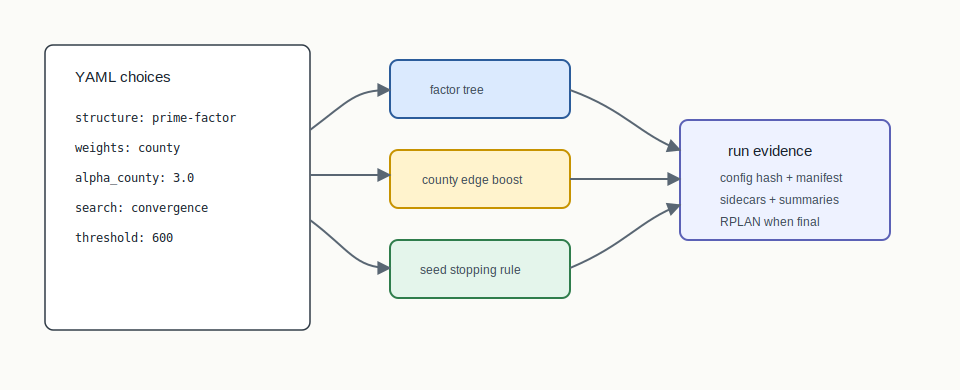

# Three-Layer Compositor


## Mental Model

The original BISECT pipeline is controlled by three independent choices:
structure, weights, and search. Structure decides the shape of the bisection
tree. Weights decide what a cut costs. Search decides how many seeds or
candidate bisections are explored before selecting a result.

## How BISECT Uses It

BISECT uses the compositor to make algorithm comparisons clean:

```text
structure layer + weights layer + search layer -> one reproducible run
```

Changing GeoSection to AreaSection should not silently change county weights or
seed search. Changing ConvergenceSweep to PercentileSweep should not silently
change the split topology.

## Step-By-Step Mechanics

1. Resolve the structure mode from CLI/config.
2. Resolve the edge or vertex weighting mode.
3. Resolve the search mode and seed budget.
4. Bind these choices into the run config and audit hash.
5. Execute the bisection tree or delegated structure family.
6. Emit run manifests, summaries, and final RPLAN sidecars when applicable.

## Picture 1: One Run, Three Independent Choices



A mature BISECT run should be explainable as three independent dials. In the
example above, `prime-factor` chooses the tree, `county` changes edge costs, and
`convergence` chooses the seed stopping rule. Changing one dial should not
silently mutate the others.

## Tiny Example

```yaml
algorithm:
  structure: prime-factor
  weights: county
  alpha_county: 3.0
  search: convergence
  convergence_threshold: 600
```

That configuration means: use the ApportionRegions factor tree, discourage
within-county cuts by boosting intra-county edges, and keep scanning seeds until
600 consecutive seeds do not improve the selected objective.

## Layer Isolation Example

The compositor is mostly a guardrail against muddy comparisons:

| Experiment | Structure | Weights | Search | Clean comparison? |
|---|---|---|---|---|
| A | `prime-factor` | `county` | `convergence` | baseline |
| B | `ratio-optimal-area` | `county` | `convergence` | yes, structure changed |
| C | `ratio-optimal-area` | `length` | `multi` | no, three layers changed |

Experiment B can support a statement about structure choice because weights and
search stayed fixed. Experiment C may still be useful, but it is a new run
recipe, not an isolated algorithm comparison.

## Manifest Reading Checklist

- The resolved structure, weights, and search values should appear after legacy
  aliases are normalized.
- The config hash should change when any layer changes.
- Sidecars should say which layer produced each piece of evidence: ratio scan,
  weight summary, seed search summary, or final audit package.

## What The Output Needs To Explain

The output evidence should identify the resolved layer choices, the config hash,
the METIS/backend settings where relevant, seed-search settings, output
sidecars, and any final RPLAN/RCTX/certificate package. A reviewer should be
able to tell which layer changed between two runs.

Example output fields:

```json
{
  "structure": "prime-factor",
  "weights": "county",
  "search": "convergence",
  "config_hash": "sha256:...",
  "sidecars": ["ratio-scan.json", "weight-summary.json", "seed-search.json"]
}
```

## Claim Boundary

The compositor gives BISECT a clean experimental design. It does not mean every
cross-layer combination has been empirically validated or legally reviewed.
Some combinations are implementation-valid but not publication-validated.

## Failure Modes

- A CLI flag changes a layer but the config hash or run manifest does not record
  it.
- A legacy `--partition-mode` value and YAML `structure:` value are confused.
- A comparison changes multiple layers while claiming to isolate one algorithm.

## References In This Repo

- Concept guide: `docs/concepts/three-layer-compositor.md`
- Taxonomy: `docs/concepts/section-algorithms.md`
- CLI implementation: `crates/bisect-cli/src/runner.rs`
- Tests: `crates/bisect-cli/src/runner.rs` contains parser and layer-resolution
  tests for structure/search combinations.
