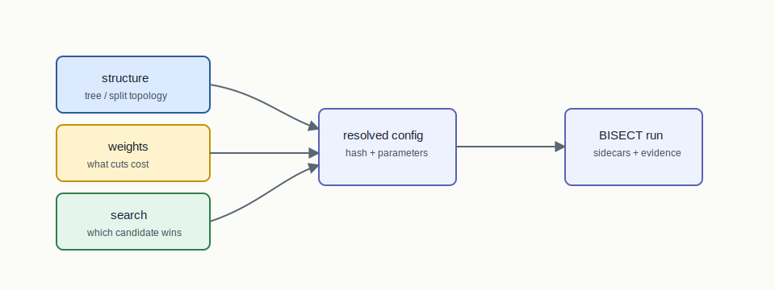

# Three-Layer Compositor



## Mental Model

The original BISECT pipeline is controlled by three independent choices:
structure, weights, and search. Structure decides the shape of the bisection
tree. Weights decide what a cut costs. Search decides how many seeds or
candidate bisections are explored before selecting a result.

## How BISECT Uses It

BISECT uses the compositor to make algorithm comparisons clean:

```text
structure layer + weights layer + search layer -> one reproducible run
```

Changing GeoSection to AreaSection should not silently change county weights or
seed search. Changing ConvergenceSweep to PercentileSweep should not silently
change the split topology.

## Step-By-Step Mechanics

1. Resolve the structure mode from CLI/config.
2. Resolve the edge or vertex weighting mode.
3. Resolve the search mode and seed budget.
4. Bind these choices into the run config and audit hash.
5. Execute the bisection tree or delegated structure family.
6. Emit run manifests, summaries, and final RPLAN sidecars when applicable.

## Claim Boundary

The compositor gives BISECT a clean experimental design. It does not mean every
cross-layer combination has been empirically validated or legally reviewed.

## References In This Repo

- Concept guide: `docs/concepts/three-layer-compositor.md`
- Taxonomy: `docs/concepts/section-algorithms.md`
- CLI implementation: `crates/bisect-cli/src/runner.rs`
