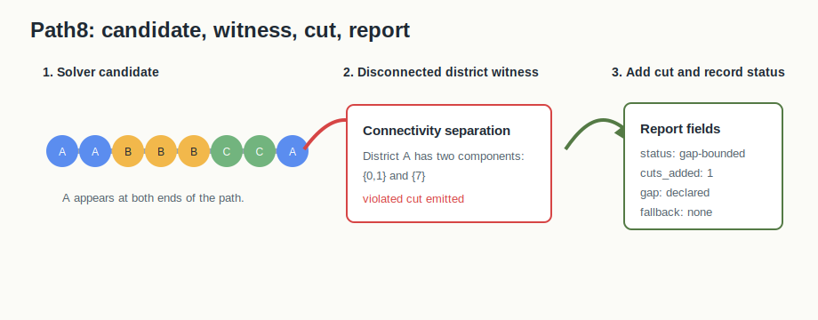

# U.16 Branch-And-Cut


## Mental Model

Branch-and-cut is exact optimization with an audit trail. BISECT starts with an
integer programming model for assigning units to districts, then strengthens
that model by separating violated connectivity cuts. The solver lifecycle must
say whether it solved, proved a bound, fell back, timed out, or only emitted a
formulation.

## How BISECT Uses It

U.16 is the solver-backed path for small or staged exact instances. BISECT uses
it when the question is no longer "can we construct a valid plan?" but "can we
prove or bound the best plan under this declared objective and constraint
profile?"

```text
graph + objective + constraints -> ILP model -> cuts/bounds -> audit package
```

The output is only useful if the status vocabulary is explicit. A solved exact
package, a fallback package, and a formulation-only artifact are different
claims.

## Picture 0: Incumbent To Connectivity Cut

The opening figure shows the branch-and-cut loop as an audit story. The ILP
model proposes a candidate incumbent. The connectivity checker inspects the
candidate as a graph assignment, not just as variable values. In the path
example, district A appears at both ends of the path, so A has two components:
`{0,1}` and `{7}`.

That graph failure becomes a violated connectivity cut, the model is resolved,
and the lifecycle report records what happened. The report fields are what make
the claim boundary visible: `solved`, `gap-bounded`, `fallback`, `timeout`, and
`formulation-only` mean different things. BISECT needs both the model witness
and the solve report before it can treat the output as an auditable U.20
package.

## Picture 1: Model, Separation, And Status


The formulation starts with assignment, population, objective, and graph
constraints. If a candidate solution disconnects a district, the separation
routine adds connectivity cuts and resolves. The report records solver mode,
cut activity, incumbent objective, lower bound, gap, fallback reason, and
parameter hash.

## Picture 2: Tiny Path8 Connectivity Cut



The path8 benchmark is intentionally small enough to inspect by hand. A solver
candidate can assign district A to both ends of the path while the middle units
belong to other districts. That assignment can look feasible to the relaxed
model but fails district connectivity. Separation turns the failure into a
specific violated cut, resolves, and writes both the formulation artifact and
the solve report.

## Step-By-Step Mechanics

1. Build the ILP formulation for the declared graph and objective.
2. Solve the current relaxation or integer model under the configured mode.
3. Validate candidate district connectedness.
4. Add violated connectivity cuts when separation is active.
5. Repeat until solved, bounded, timed out, or fallback is triggered.
6. Emit an ILP solve report and algorithm lineage.
7. Package any final plan through RPLAN/RCTX/audit certificate/manifest.

## Tiny Example

In the path8 package, `node_root.lp` is the model witness and
`ilp-solve-report.json` is the lifecycle witness. The plan is not just "the
solver output"; it is a package saying which model was used, what status was
reached, whether cuts were active, and how the final assignment was bound into
the same U.20 audit bundle as non-solver plans.

## Report Reading Checklist

| Field | Why it matters |
|---|---|
| `method` | distinguishes branch-and-cut from other exact modes |
| `status` | says solved, bounded, fallback, timeout, or formulation-only |
| `incumbent_objective` | explains the best found plan |
| `lower_bound` and `gap` | explain what is proven about optimality |
| `cuts_added` | shows whether connectivity separation was active |
| `fallback_reason` | prevents an unsolved run from masquerading as exact |

Example report shape:

```json
{
  "method": "branch-and-cut",
  "status": "gap-bounded",
  "incumbent_objective": 17.0,
  "lower_bound": 16.0,
  "gap": 0.0588,
  "cuts_added": 3
}
```

## What The Certificate Needs To Explain

The certificate binds the final plan to the RCTX context. The U.16 lineage adds
solver-specific evidence: branch-and-cut mode, separation activity, solver
status, bound/gap fields, fallback status, and report identity. Those fields
make a solver-backed plan reviewable without duplicating reserved certificate
fields.

## Claim Boundary

U.16 can document exact or gap-bounded behavior for the declared tiny/staged
instance. It does not imply that every large real instance was solved to
optimality, and it does not claim branch-and-cut dominates construction or
search methods.

## Failure Modes

- A disconnected incumbent must produce separation evidence or a fallback
  status, not a silent accepted plan.
- A timeout or external solver failure can still be useful if the report says
  formulation-only, bounded, fallback, or no-solution explicitly.
- A package without `node_root.lp`, solve status, or parameter identity is not
  enough evidence for a branch-and-cut claim.

## References In This Repo

- Crate: `bisect-ilp`
- Core files: `crates/bisect-ilp/src/formulation.rs`, `crates/bisect-ilp/src/separation.rs`, `crates/bisect-ilp/src/output.rs`
- CLI surface: `--structure ilp --ilp-method branch-and-cut`
- Paper: `docs/papers/U.16+branch-and-cut-redistricting.pdf`
- Golden package: `docs/examples/rplan-golden-packages/U.16+branch-and-cut/`
- Benchmark package: `docs/examples/rplan-benchmark-packages/U.16+branch-and-cut-path8-benchmark/`
- Report witnesses: `docs/examples/rplan-benchmark-packages/U.16+branch-and-cut-path8-benchmark/node_root.lp`, `docs/examples/rplan-benchmark-packages/U.16+branch-and-cut-path8-benchmark/ilp-solve-report.json`
