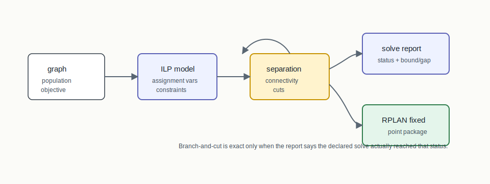
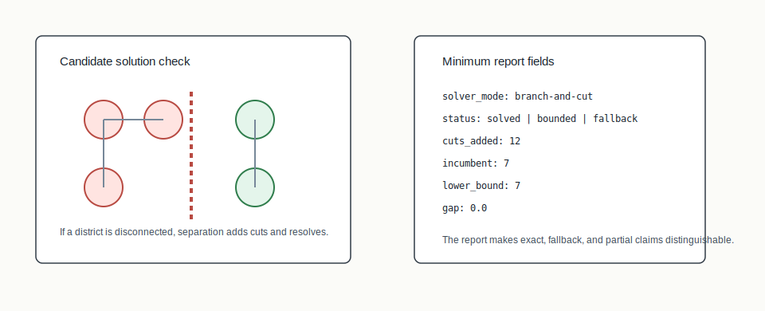

# U.16 Branch-And-Cut



## Mental Model

Branch-and-cut is exact optimization with an audit trail. BISECT starts with an
integer programming model for assigning units to districts, then strengthens
that model by separating violated connectivity cuts. The solver lifecycle must
say whether it solved, proved a bound, fell back, timed out, or only emitted a
formulation.

## How BISECT Uses It

U.16 is the solver-backed path for small or staged exact instances. BISECT uses
it when the question is no longer "can we construct a valid plan?" but "can we
prove or bound the best plan under this declared objective and constraint
profile?"

```text
graph + objective + constraints -> ILP model -> cuts/bounds -> audit package
```

The output is only useful if the status vocabulary is explicit. A solved exact
package, a fallback package, and a formulation-only artifact are different
claims.

## Picture 1: Model, Separation, And Status



The formulation starts with assignment, population, objective, and graph
constraints. If a candidate solution disconnects a district, the separation
routine adds connectivity cuts and resolves. The report records solver mode,
cut activity, incumbent objective, lower bound, gap, fallback reason, and
parameter hash.

## Step-By-Step Mechanics

1. Build the ILP formulation for the declared graph and objective.
2. Solve the current relaxation or integer model under the configured mode.
3. Validate candidate district connectedness.
4. Add violated connectivity cuts when separation is active.
5. Repeat until solved, bounded, timed out, or fallback is triggered.
6. Emit an ILP solve report and algorithm lineage.
7. Package any final plan through RPLAN/RCTX/audit certificate/manifest.

## What The Certificate Needs To Explain

The certificate binds the final plan to the RCTX context. The U.16 lineage adds
solver-specific evidence: branch-and-cut mode, separation activity, solver
status, bound/gap fields, fallback status, and report identity. Those fields
make a solver-backed plan reviewable without duplicating reserved certificate
fields.

## Claim Boundary

U.16 can document exact or gap-bounded behavior for the declared tiny/staged
instance. It does not imply that every large real instance was solved to
optimality, and it does not claim branch-and-cut dominates construction or
search methods.

## References In This Repo

- Crate: `bisect-ilp`
- CLI surface: `--structure ilp --ilp-method branch-and-cut`
- Paper: `docs/papers/U.16+branch-and-cut-redistricting.pdf`
- Golden package: `docs/examples/rplan-golden-packages/U.16+branch-and-cut/`
- Benchmark package: `docs/examples/rplan-benchmark-packages/U.16+branch-and-cut-path8-benchmark/`
