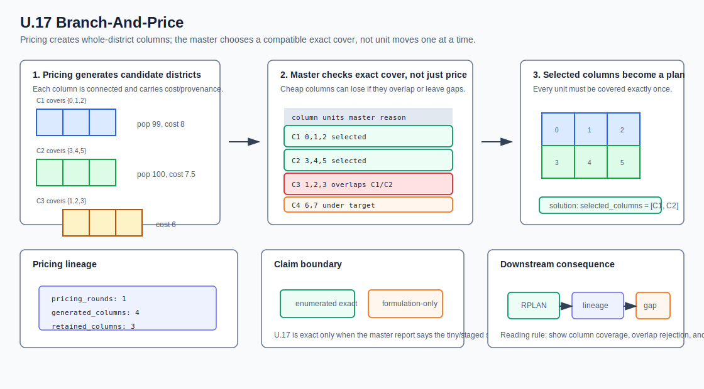
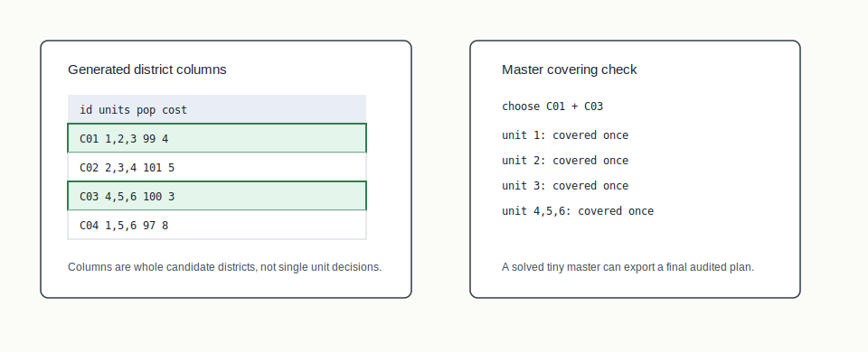

# U.17 Branch-And-Price



## Mental Model

Branch-and-price solves a plan as a set-partitioning problem over whole
district columns. Instead of assigning every unit directly in one monolithic
model, the solver works with candidate districts: each column is a connected,
population-feasible district, and the master problem chooses a set of columns
that covers every unit exactly once.

## How BISECT Uses It

U.17 gives BISECT a distinct exact-optimization lifecycle from U.16. BISECT uses
it when district-level columns, pricing rounds, and master-problem evidence are
the right solver vocabulary.

```text
generate columns -> solve master problem -> record bounds/gap/provenance
```

The current slice is intentionally modest: formulation-only reports for larger
cases and deterministic exact enumeration for tiny fixtures.

## Picture 1: Pricing Columns Into A Master



Pricing generates candidate connected districts. The master problem then asks
which compatible columns cover all units once. A chosen column set becomes the
plan assignment if the fixture solve succeeds.

## Step-By-Step Mechanics

1. Generate connected, population-feasible district columns for small graphs.
2. Record column identities, covered units, cost, and pricing round metadata.
3. Build the set-partitioning master problem over generated columns.
4. Emit formulation-only reports when solving is out of scope.
5. Solve tiny masters by deterministic enumeration.
6. Record status, pricing rounds, generated column count, bounds, gap, and
   optional solution.
7. Package solved final plans through the RPLAN fixed point.

## What The Certificate Needs To Explain

The audit certificate verifies the exported plan. The U.17 lineage explains how
that plan came from the column-generation lifecycle: pricing metadata,
master-problem status, bounds/gap when available, and whether the run was a true
solved output or only a formulation.

## Claim Boundary

U.17 is not yet a production branch-and-price solver. It establishes the audited
contract and tiny exact path that later pricing, branching, and solver
integrations must preserve.

## References In This Repo

- Crate: `bisect-column`
- CLI surface: `bisect exact --method branch-and-price`
- Paper: `docs/papers/U.17+branch-and-price-redistricting.pdf`
- Golden package: `docs/examples/rplan-golden-packages/U.17+branch-and-price/`
