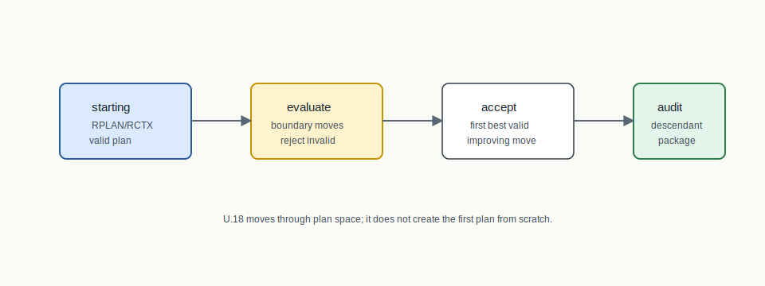
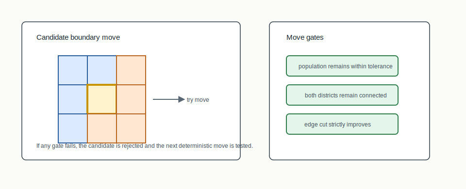
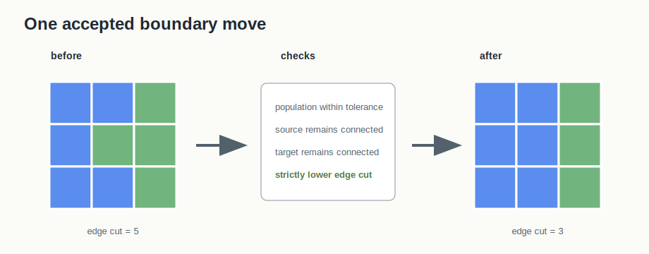

# U.18 Local Search



## Mental Model

Local search starts from an existing valid plan and tries to improve it without
breaking the declared audit profile. The first staged kernel evaluates
deterministic one-vertex boundary moves. A move is accepted only when it
strictly improves the objective and preserves population tolerance and district
connectedness.

## How BISECT Uses It

U.18 is not a plan constructor from scratch. BISECT uses it as an improver over
an existing RPLAN/RCTX pair.

```text
audited starting plan -> validity-preserving move -> descendant audit package
```

This makes local search the bridge between construction families and later
repair-aware evolutionary workflows. It also gives BISECT a disciplined place
to stage tabu and large-neighborhood search parameters.

## Picture 1: Boundary Move Evaluation



The kernel looks at boundary units, tries moving a unit into a neighboring
district, and rejects moves that violate population or contiguity. The accepted
move is deterministic for a fixed input.

## Picture 2: Before And After



The visual claim is deliberately narrow: one boundary unit moves, edge cut goes
down, and both districts stay connected and population-feasible. The result is
a descendant plan, not a new plan from nowhere.

## Step-By-Step Mechanics

1. Load an existing plan assignment in RPLAN unit order.
2. Evaluate deterministic one-vertex boundary moves.
3. Check population tolerance after each candidate move.
4. Check district contiguity after each candidate move.
5. Accept the lexicographically first best move that strictly reduces edge cut.
6. Preserve the assignment when no improving valid move exists.
7. Emit a local-search summary and algorithm lineage.

## Tiny Example

The method package carries `local-search-summary.json`, `method-transcript.json`,
and the usual RPLAN/RCTX/audit/manifest bundle. The summary is where reviewers
see moves evaluated, moves accepted, edge-cut change, population deviation, and
the deterministic parameter hash.

## What The Certificate Needs To Explain

The certificate verifies the descendant plan. The local-search summary explains
the transition: method, status, moves evaluated, moves accepted, initial/final
edge cut, initial/final population deviation, tolerance, and parameter hash.

## Claim Boundary

The staged U.18 kernel proves a deterministic validity-preserving improvement
path for the fixture. It does not claim global optimality or full tabu/LNS
performance.

## Failure Modes

- A visually attractive move can be rejected because it disconnects the source
  district.
- A move can improve edge cut but violate population tolerance.
- "No improving move" is a valid status when the algorithm evaluated the
  declared neighborhood and kept the input plan unchanged.

## References In This Repo

- Crate: `bisect-local-search`
- Core files: `crates/bisect-local-search/src/search.rs`, `crates/bisect-local-search/src/metrics.rs`, `crates/bisect-local-search/src/output.rs`
- CLI surface: `bisect improve --plan PATH --context PATH --method one-move`
- Tests: `crates/bisect-local-search/tests/l0_one_move.rs`, `crates/bisect-local-search/tests/l1_lineage.rs`
- Paper: `docs/papers/U.18+large-neighborhood-search.pdf`
- Golden package: `docs/examples/rplan-golden-packages/U.18+local-search-improvement/`
- Method package: `docs/examples/rplan-method-packages/U.18+local-search-generated-descendant/`
- Benchmark package: `docs/examples/rplan-benchmark-packages/U.18+local-search-grid10-benchmark/`
