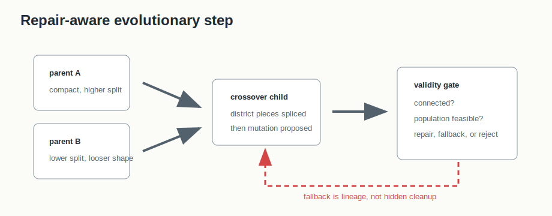

# U.19 Evolutionary Comparison


## Mental Model

Evolutionary comparison explores trade-offs among competing objectives. BISECT's
U.19 path extends the Pareto/NSGA-II machinery with repair-aware crossover,
mutation, validity status, and selected-frontier audit packaging.

The frontier file can stay lightweight, but any selected plan that moves
downstream must become a full RPLAN/RCTX/audit package.

## How BISECT Uses It

U.19 is the comparison layer. BISECT uses it to ask which plans sit on a
trade-off frontier and then export a chosen frontier entry for ordinary audit.

```text
population of plans -> crossover/mutation/selection -> selected-frontier package
```

It is not a replacement for construction or exact optimization. It is the
multi-objective layer that can compare outputs and preserve selected-plan
lineage.

## Picture 0: Frontier Selection With Validity Lineage

The opening figure shows the U.19 decision as a comparison, not a single-score
optimization. Crossover and mutation create candidate children, but invalid or
repaired children remain visible in lineage. The frontier then records objective
values, generation, validity status, and selected index.

The selected entry is not "best" in every objective. In the example, index 1
has a higher edge cut than some alternatives, but fewer county splits. That is
the trade-off being selected. BISECT therefore needs the selected-frontier index
and objective context before the chosen plan can move downstream into an
ordinary RPLAN/RCTX/audit package.

## Picture 1: Frontier To Selected Package


The frontier records objective values, validity status, generation, seed
metadata, and plan identity. A selected frontier entry is converted into RPLAN
assignments and verified against the supplied RCTX context.

## Picture 2: Repair-Aware Crossover



U.19 is not allowed to hide invalid offspring. Crossover and mutation can
produce a child that fails connectedness or population checks. The algorithm
must repair, fall back, or reject the candidate and then record that path before
frontier scoring.

## Step-By-Step Mechanics

1. Initialize a deterministic population from content/base seeds.
2. Apply ReCom-style crossover with validity fallback.
3. Apply boundary-flip mutation with validity fallback.
4. Score objective values and update Pareto ranking/crowding distance.
5. Emit frontier entries with per-plan validity status.
6. Select a frontier entry by zero-based index.
7. Package the selected plan as RPLAN/RCTX/audit certificate/manifest.

## Tiny Example

The selected-frontier package is the key teaching artifact. The frontier can be
lightweight, but a chosen entry becomes an ordinary audit bundle with
`method-transcript.json`, objective values, selected index, generation, producer
identity, and validity status.

## Worked Frontier Table

| Frontier index | Generation | Edge cut | County splits | Validity | Selected? |
|---:|---:|---:|---:|---|---|
| 0 | 4 | 130 | 13 | valid |  |
| 1 | 5 | 137 | 8 | valid | yes |
| 2 | 5 | 128 | 16 | valid |  |
| 3 | 6 | 126 | 9 | repaired |  |

Index 1 is not "best" in every objective. It is selected because it occupies a
chosen trade-off position. The package needs to preserve that selection context
so readers do not treat it as a single-objective optimum.

## Frontier Reading Checklist

- Each row should carry objective values and validity status.
- Repaired or fallback children should remain visible after ranking.
- The selected package should record the zero-based selected index and the
  configuration that produced the frontier.

## What The Certificate Needs To Explain

The selected-frontier certificate verifies the exported plan. The lineage must
carry selected index, configuration, validity status, generation, objective
values, and `bisect-pareto` producer identity so the chosen point can be traced
back to the frontier.

Example lineage fields:

```json
{
  "method": "evolutionary-comparison",
  "selected_frontier_index": 1,
  "generation": 5,
  "objectives": { "edge_cut": 137, "county_splits": 8 },
  "validity": "valid"
}
```

## Claim Boundary

U.19 documents reproducible comparison and selected-plan packaging. It does not
claim the evolutionary search found all possible Pareto-optimal plans or that a
selected frontier plan is legally superior.

## Failure Modes

- A child can inherit incompatible district pieces; validity fallback must be
  visible in lineage.
- Frontier rank can change when objectives or seeds change, so selected index
  and configuration are part of the evidence.
- A selected plan must pass the same RPLAN/RCTX audit checks as a plan created
  by construction, exact optimization, or local search.

## References In This Repo

- Crate: `bisect-pareto`
- Core files: `crates/bisect-pareto/src/crossover.rs`, `crates/bisect-pareto/src/mutation.rs`, `crates/bisect-pareto/src/output.rs`, `crates/bisect-pareto/src/audit.rs`
- CLI surface: `bisect pareto --selected-frontier-index ...`
- Tests: `crates/bisect-pareto/tests/L0_unit.rs`, `crates/bisect-pareto/tests/L1_integration.rs`
- Paper: `docs/papers/U.19+evolutionary-search-comparison.pdf`
- Golden package: `docs/examples/rplan-golden-packages/U.19+selected-frontier/`
