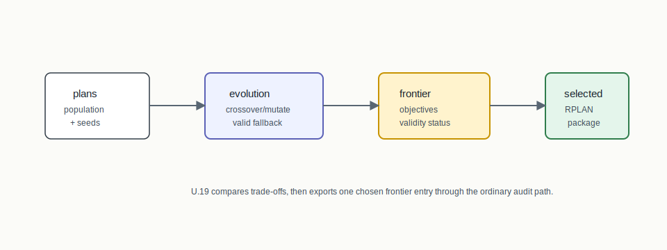
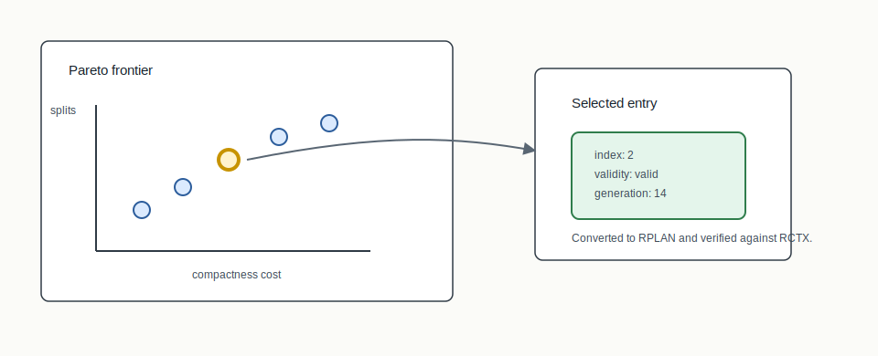

# U.19 Evolutionary Comparison



## Mental Model

Evolutionary comparison explores trade-offs among competing objectives. BISECT's
U.19 path extends the Pareto/NSGA-II machinery with repair-aware crossover,
mutation, validity status, and selected-frontier audit packaging.

The frontier file can stay lightweight, but any selected plan that moves
downstream must become a full RPLAN/RCTX/audit package.

## How BISECT Uses It

U.19 is the comparison layer. BISECT uses it to ask which plans sit on a
trade-off frontier and then export a chosen frontier entry for ordinary audit.

```text
population of plans -> crossover/mutation/selection -> selected-frontier package
```

It is not a replacement for construction or exact optimization. It is the
multi-objective layer that can compare outputs and preserve selected-plan
lineage.

## Picture 1: Frontier To Selected Package



The frontier records objective values, validity status, generation, seed
metadata, and plan identity. A selected frontier entry is converted into RPLAN
assignments and verified against the supplied RCTX context.

## Step-By-Step Mechanics

1. Initialize a deterministic population from content/base seeds.
2. Apply ReCom-style crossover with validity fallback.
3. Apply boundary-flip mutation with validity fallback.
4. Score objective values and update Pareto ranking/crowding distance.
5. Emit frontier entries with per-plan validity status.
6. Select a frontier entry by zero-based index.
7. Package the selected plan as RPLAN/RCTX/audit certificate/manifest.

## What The Certificate Needs To Explain

The selected-frontier certificate verifies the exported plan. The lineage must
carry selected index, configuration, validity status, generation, objective
values, and `bisect-pareto` producer identity so the chosen point can be traced
back to the frontier.

## Claim Boundary

U.19 documents reproducible comparison and selected-plan packaging. It does not
claim the evolutionary search found all possible Pareto-optimal plans or that a
selected frontier plan is legally superior.

## References In This Repo

- Crate: `bisect-pareto`
- CLI surface: `bisect pareto --selected-frontier-index ...`
- Paper: `docs/papers/U.19+evolutionary-search-comparison.pdf`
- Golden package: `docs/examples/rplan-golden-packages/U.19+selected-frontier/`
