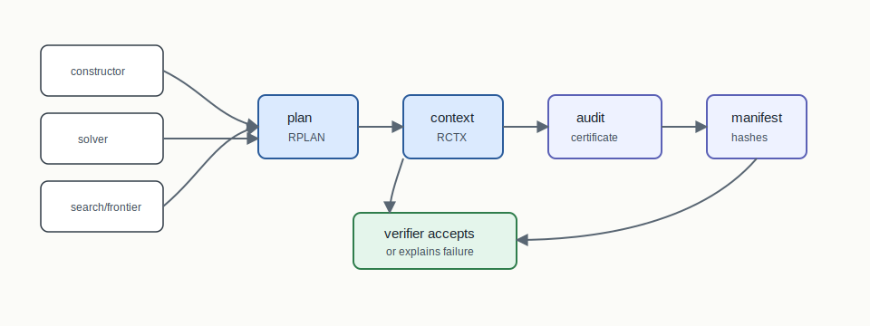
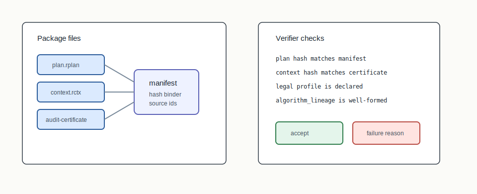
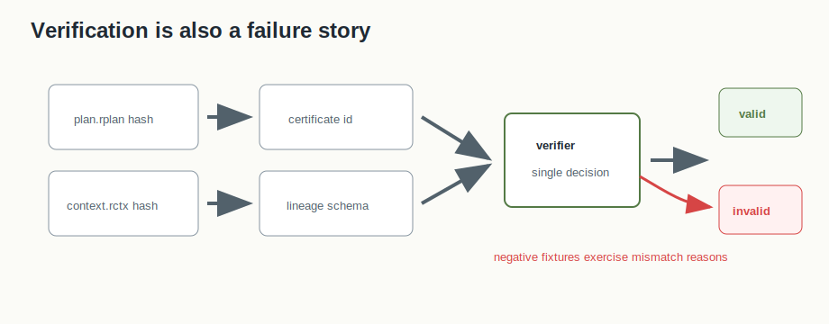

# U.20 RPLAN Audit Certificates



## Mental Model

U.20 is the fixed point that lets different algorithms share one verification
story. A constructor, solver, search improver, or frontier exporter may use
different internal machinery, but a final plan must converge to the same
artifact bundle: `plan.rplan`, `context.rctx`, `audit-certificate.json`,
`manifest.json`, and method lineage.

## How BISECT Uses It

BISECT uses U.20 as the acceptance layer for final plans. The algorithm may be
T.14 spectral, U.16 branch-and-cut, U.18 local search, or another producer, but
the audit question is the same:

```text
does this plan match this context and declared profile, with replayable lineage?
```

That fixed point is why new algorithm families can be added without inventing a
bespoke verifier every time.

## Picture 1: The Fixed Point



The manifest ties together the plan, context, certificate, method transcript,
and optional method reports. The verifier checks hashes, certificate identity,
context identity, declared profile, and lineage shape.

## Picture 2: Failure Is Part Of The Contract



The fixed point is strongest when it explains rejection as clearly as
acceptance. Hash mismatch, context mismatch, profile mismatch, certificate
identity mismatch, and malformed lineage are different failures. They should
surface as structured reasons, not as one generic invalid result.

## Step-By-Step Mechanics

1. Write the final plan assignment as RPLAN.
2. Write the graph/population/legal context as RCTX.
3. Generate an audit certificate against that context and profile.
4. Add algorithm lineage using stable producer APIs.
5. Write a manifest that binds sources, hashes, certificate identity, and
   optional reports.
6. Verify with `rplan verify-certificate` or `bisect verify --manifest`.
7. Report structured failure reasons when hashes, context, profile, or lineage
   do not match.

## Tiny Example

The `grid3x3-valid` reference package is the smallest positive example. The
negative fixtures document the opposite side: a verifier must reject packages
whose hashes, certificate identity, or declared context no longer line up. That
positive/negative pair is what makes U.20 a reusable acceptance layer rather
than a ceremonial export format.

## What The Certificate Needs To Explain

The certificate explains plan validity under a declared context and profile.
Algorithm-specific lineage explains how the plan was produced. Keeping those
layers distinct prevents solver reports, construction summaries, or frontier
metadata from becoming ad hoc certificate fields.

## Claim Boundary

U.20 proves the artifact can be independently checked against declared data and
profiles. It does not certify legal sufficiency in the world, algorithmic
optimality, or empirical superiority.

## Failure Modes

- Editing `plan.rplan` after certificate generation must break verification.
- Reusing a certificate with a different context must break verification.
- Algorithm lineage can be rich, but certificate validity must remain tied to
  declared context/profile facts rather than unreviewed method claims.

## References In This Repo

- Crates: `rplan-core`, `rplan-io`, `rplan-audit`
- CLI surfaces: `rplan verify-certificate`, `bisect verify --manifest`
- Paper: `docs/papers/U.20+plan-audit-certificates.pdf`
- Reference package: `docs/examples/u20-plan-audit-certificates/grid3x3-valid/`
- Negative fixtures: `docs/examples/u20-plan-audit-certificates/NEGATIVE-FIXTURES.md`
- Benchmark package: `docs/examples/rplan-benchmark-packages/U.20+audit-grid10-benchmark/`
